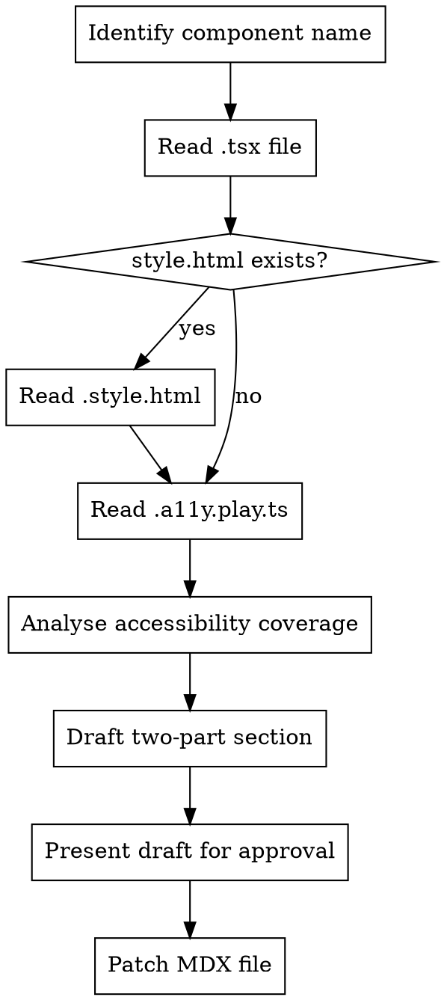

# Add Component A11y Docs

Generates and inserts an `## Accessibility` section into the component's MDX file, placed **after `## Integration`** and **before `<Footer />`**. The section has two subsections: what developers must do in HTML/CSS-only mode, and what the web component handles automatically.

## Process



## Step 1 — Identify component

Derive `<component>` from the file the user references or the current working context. Resolve:

- Component TSX: `packages/core/src/components/<component>/<component>.tsx`
- Style HTML: `packages/core/src/components/<component>/test/<component>.style.html` (may not exist)
- A11y tests: `packages/core/src/components/<component>/test/<component>.a11y.play.ts`
- MDX doc: `docs/src/components/<component>/<component>.mdx`

## Step 2 — Read source files

Read all files that exist. Extract:

**From `.tsx`:**
- Every `aria-*` attribute set in `render()` — note which are static vs. dynamic
- Every `role` attribute set on host or inner elements
- Props that are propagated to child elements (e.g. `disabled` → all inputs)
- Keyboard interaction managed by the component (arrow key navigation, Enter/Space handling)
- Form association (`@AttachInternals`, `internals.setFormValue`)
- Any state-driven ARIA (e.g. `aria-expanded`, `aria-selected`, `aria-checked`)

**From `.style.html`:**
- Semantic HTML elements used (`<fieldset>`, `<legend>`, `<input>`, `<button>`, etc.)
- ARIA attributes present in the HTML examples
- Attributes that are absent in style.html but should be set for full accessibility (gaps)
- How disabled / invalid / required states are expressed

**From `.a11y.play.ts`:**
- Which test scenarios are covered (states/variants that are axe-tested)

## Step 3 — Analyse coverage

Classify every accessibility feature into one of three buckets:

| Bucket | Meaning |
|--------|---------|
| **WC — internal** | The web component sets it automatically; consumer does nothing |
| **HTML — required** | Developer must apply it manually in HTML/CSS-only mode |
| **HTML — gap** | Missing from the style.html examples but still needed for WCAG compliance |

Gaps must be called out explicitly in the HTML section as things the developer **must add** even though the style.html example does not show them.

## Step 4 — Draft the section

Use this exact template. Adapt headings and bullet content to the component:

```mdx
## Accessibility

### HTML / CSS only

Use semantic HTML so assistive technologies understand the component's structure and state without JavaScript.

<Markdown>
  {`
| Requirement     | How to implement                                                                           |
| --------------- | ------------------------------------------------------------------------------------------ |
| Group label     | Wrap options in \`<fieldset>\` and provide a \`<legend>\` as the group label               |
| Radio semantics | Use \`<input type="radio">\` for each option, each wrapped in a \`<label>\`                |
| Disabled state  | Add the \`disabled\` attribute to each \`<input>\` and \`class="is-disabled"\` to the container |
| Invalid state   | Add \`aria-invalid="true"\` to each \`<input>\` and \`class="is-danger"\` to the container |
| Required state  | Add \`required\` to at least one \`<input>\` in the group                                  |
| Icon-only items | Add \`aria-label\` and \`title\` to the wrapping \`<label>\` when no visible text is present |
`}
</Markdown>

> Keyboard navigation between options (arrow keys) is a native browser behavior for radio inputs grouped under the same `name` — no extra scripting needed.

### Web component

The `ds-<component>` element manages the following automatically:

- **Group role** — renders a `fieldset`/`role="group"` container so screen readers announce the group label
- **`aria-checked`** — kept in sync with the selected value on each option label
- **`aria-invalid`** — applied to labels and inputs when the `invalid` prop is set
- **`aria-disabled`** — applied to labels when the `disabled` prop is set; `disabled` is also forwarded to every `<input>`
- **`aria-label` / `title`** — set on icon-only labels when `icon-only` is active so the option remains accessible without visible text
- **Keyboard navigation** — arrow keys cycle through options; handled natively by the `<input type="radio">` elements rendered in the shadow DOM
- **Form association** — uses `ElementInternals` to participate in native `<form>` submit and reset without any extra markup

### References

- [`<fieldset>`](https://developer.mozilla.org/en-US/docs/Web/HTML/Element/fieldset) — MDN
- [`<legend>`](https://developer.mozilla.org/en-US/docs/Web/HTML/Element/legend) — MDN
- [`<input type="radio">`](https://developer.mozilla.org/en-US/docs/Web/HTML/Element/input/radio) — MDN
- [`<label>`](https://developer.mozilla.org/en-US/docs/Web/HTML/Element/label) — MDN
- [`aria-checked`](https://developer.mozilla.org/en-US/docs/Web/Accessibility/ARIA/Attributes/aria-checked) — MDN
- [`aria-disabled`](https://developer.mozilla.org/en-US/docs/Web/Accessibility/ARIA/Attributes/aria-disabled) — MDN
- [`aria-invalid`](https://developer.mozilla.org/en-US/docs/Web/Accessibility/ARIA/Attributes/aria-invalid) — MDN
- [`aria-label`](https://developer.mozilla.org/en-US/docs/Web/Accessibility/ARIA/Attributes/aria-label) — MDN
- [`ElementInternals`](https://developer.mozilla.org/en-US/docs/Web/API/ElementInternals) — MDN
```

Adapt the tables and bullet lists to match what the component actually does. Remove rows/links that do not apply; add rows/links for features present in this component but not in the template.

**Rules for the two-part content:**

1. The HTML table must list every attribute/element a consumer needs to add manually. Do not omit anything that axe-core or WCAG 2.2 AA would flag.
2. Highlight gaps — requirements missing from style.html — with a `> **Note:**` blockquote so developers know to add them.
3. The WC bullet list must cover every `aria-*` / `role` attribute the component sets, plus keyboard handling and form participation if present.
4. Keep prose minimal — prefer the table and bullet list over paragraphs.
5. Do not duplicate information that already lives in the Component API section (props, events).
6. **Markdown tables must be wrapped in `<Markdown>{``}</Markdown>`** — raw MDX cannot render markdown tables directly. Escape backticks inside the template literal as `\``. The `Markdown` component is already imported via `import { Canvas, Markdown, Meta } from '@storybook/addon-docs/blocks'` at the top of every MDX file; verify it is present before writing. Use American spelling (e.g. "behavior", not "behaviour") to avoid cSpell warnings.
7. **Always add a `### References` subsection** after the Web component section listing MDN links for every HTML element, ARIA attribute, and Web API mentioned in the section. Use these canonical MDN URL patterns:
   - HTML elements: `https://developer.mozilla.org/en-US/docs/Web/HTML/Element/<element>` (e.g. `/Element/fieldset`, `/Element/input/radio`)
   - ARIA attributes: `https://developer.mozilla.org/en-US/docs/Web/Accessibility/ARIA/Attributes/<attribute>`
   - Web APIs: `https://developer.mozilla.org/en-US/docs/Web/API/<Interface>`
   Format each entry as: `- [\`<name>\`](<url>) — MDN`

## Step 5 — Present for approval

Show the full draft section to the user and ask for confirmation before writing.

```
Here is the proposed ## Accessibility section for ds-<component>:

---
<draft section here>
---

Shall I add this to docs/src/components/<component>/<component>.mdx?
```

## Step 6 — Patch the MDX file

After approval, insert the section into the MDX file. Find the pattern:

```mdx
## Integration

import integration from '../../snippets/integration.md?raw'

<Markdown>{integration}</Markdown>

<Footer />
```

And replace it with:

```mdx
## Integration

import integration from '../../snippets/integration.md?raw'

<Markdown>{integration}</Markdown>

## Accessibility

### HTML / CSS only

<the generated HTML section>

### Web component

<the generated WC section>

### References

<MDN links for every HTML element, ARIA attribute, and Web API mentioned above>

<Footer />
```

Use the Edit tool with `old_string` / `new_string` — never rewrite the whole file.

## What NOT to include

- Do not reproduce the Component API table — that is already in `api.md`.
- Do not list colour contrast ratios — those belong to the design token docs.
- Do not include code examples showing the full component markup — the story tabs already show that.
- Do not mention framework-specific integration (Angular, React) — that is covered by the integration snippet.
