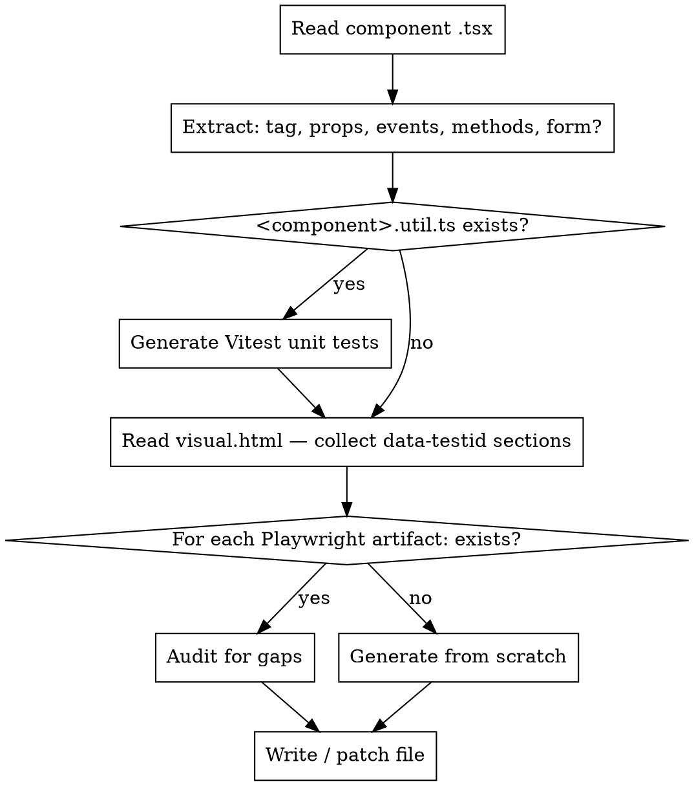

# Generate Component Tests

Generates or audits all required test artifacts for a Baloise DS component. For each file: read the existing file first (if it exists), identify what is missing, then write only the gaps.

## Process



## Step 1 — Analyse the Component

Read `packages/core/src/components/<component>/<component>.tsx` and extract:

| What to extract                                           | Where to use it                        |
| --------------------------------------------------------- | -------------------------------------- |
| Component `tag` (e.g. `ds-toggle`)                        | all files                              |
| All `@Prop()` names, types, defaults                      | a11y variants, component test states   |
| Enum/union props (`DS.FooColor`, `DS.FooSize`, etc.)      | a11y test — one test per allowed value |
| `@Event()` emitters + detail type                         | component test event spies             |
| `@Method()` public methods                                | component test method calls            |
| Props: `name`, `value`, `checked`, `disabled`, `readonly` | form tests, PO interaction methods     |
| Shadow-part selectors used in render                      | PO locators                            |

**Is it a form component?** Yes if it has both `name` and `value` props (toggle, checkbox, radio, input, select). Form components need form-reset tests.

## Step 2 — Vitest Unit Tests for Util Functions

**Check:** Does `packages/core/src/components/<component>/<component>.util.ts` exist?

If yes → read it fully, then generate or audit `packages/core/src/components/<component>/test/<component>.util.spec.ts`.

**Coverage required — test every exported function:**

- Happy path for each input combination
- Edge / boundary values (empty string, 0, negative, max)
- All branches in conditionals (each `if / else if / else`)
- Guard clauses / input normalization (invalid input resets to default)
- Each combination of parameters that takes a different code path

**Format:** Vitest globals (`describe`, `it`, `expect`) are available without importing. Only import the functions under test.

```ts
import { myUtil } from '../<component>.util'

describe('myUtil', () => {
  it('returns expected value for normal input', () => {
    expect(myUtil('hello')).toBe('HELLO')
  })

  it('returns empty string for empty input', () => {
    expect(myUtil('')).toBe('')
  })
})
```

**Key rules:**

- One `describe` block per exported function
- One `it` per distinct behaviour / branch — not per input value
- Group related assertions inside one `it` only when they test the same behaviour
- File lives in `test/` subfolder: `test/<component>.util.spec.ts`
- Import path from `test/` back to util: `'../<component>.util'`

## Step 3 — Read visual.html Sections

Parse every `<section data-testid="…">` from:

```
packages/core/src/components/<component>/test/<component>.visual.html
```

Collect the list of section ids (e.g. `['basic', 'disabled', 'invalid', 'sizes', 'form']`). These drive both the visual test and the a11y test variant list.

## Step 4 — Page Object

**File:** `packages/playwright/src/lib/components/<component>.po.ts`

**Audit:** Check that the PO covers every interactive element the component renders. The PO must never expose raw Playwright `Locator`s directly — always wrap in typed helper methods.

**Template:**

```ts
import { expect, Locator } from '@playwright/test'
import { E2ELocator } from '../page/utils'
import { PageObject } from './page-object'

export class Ds<PascalComponent> extends PageObject {
  // Declare locators for every shadow-part or interactive child
  readonly nativeInput: Locator

  constructor(el: E2ELocator) {
    super(el)
    this.nativeInput = el.locator('[part="input"]')
  }

  // Action methods
  async check() {
    await this.nativeInput.check()
  }
  async uncheck() {
    await this.nativeInput.uncheck()
  }
  async fill(value: string) {
    await this.nativeInput.fill(value)
  }
  async click() {
    await this.el.click()
  }

  // Assertion methods
  async assertToBeChecked() {
    await expect(this.nativeInput).toBeChecked()
  }
  async assertToBeUnchecked() {
    await expect(this.nativeInput).not.toBeChecked()
  }
  async assertToBeDisabled() {
    await expect(this.nativeInput).toBeDisabled()
  }
  async assertValue(value: string) {
    await expect(this.nativeInput).toHaveValue(value)
  }
}
```

**Rules:**

- Locators use `[part="…"]` shadow parts where possible, then `[data-testid]`, then element type
- Omit action methods that don't apply (e.g. `fill` on a toggle)
- Add assertion methods for every meaningful state the component can be in

## Step 5 — A11y Tests

**File:** `packages/core/src/components/<component>/test/<component>.a11y.play.ts`

**Coverage required:**

- One test per meaningful prop combination that could affect accessibility tree
- Always include: `default`, `disabled`
- Include per enum value for: `color`, `size`, `variant`, `label-position`, `align`
- For form components add: `checked`, `invalid`, `required`, `readonly`

**Template:**

```ts
import { test } from '@baloise/ds-playwright'

test('default', async ({ page, a11y }) => {
  await page.mount(`<ds-component value="x">Label</ds-component>`)
  await a11y('ds-component')
})

test('disabled', async ({ page, a11y }) => {
  await page.mount(`<ds-component value="x" disabled>Label</ds-component>`)
  await a11y('ds-component')
})

// Repeat per enum value:
test('variant dots', async ({ page, a11y }) => {
  await page.mount(`<ds-component variant="dots" …>Label</ds-component>`)
  await a11y('ds-component')
})
```

**Audit rule:** Every variant key found in `DS.<Component>Variant`, `DS.<Component>Color`, `DS.<Component>Size` interfaces must have a corresponding a11y test. Check `packages/core/src/components/<component>/<component>.interfaces.ts` for allowed values.

## Step 6 — Component Interaction Tests

**File:** `packages/core/src/components/<component>/test/<component>.component.play.ts`

**Required test groups (`test.describe` blocks):**

| Group                    | When required                       | What to assert                                  |
| ------------------------ | ----------------------------------- | ----------------------------------------------- |
| Per `@Event()` name      | always                              | `spyOnEvent` count + `detail` value             |
| `disabled`               | if `disabled` prop exists           | native input `.toBeDisabled()`, event count = 0 |
| `readonly`               | if `readonly` prop exists           | native input `.toBeDisabled()`                  |
| `checked` / `value`      | if `checked` or `value` prop exists | assertToBeChecked / assertValue                 |
| `form reset`             | if form component                   | check → reset → assert initial state            |
| Public `@Method()` calls | if public methods exist             | call method, assert state change + event count  |

**Template:**

```ts
import { Ds<PascalComponent>, expect, test } from '@baloise/ds-playwright'

test.describe('dsChange', () => {
  test('should fire dsChange with correct detail', async ({ page }) => {
    await page.mount(`<ds-component value="x">Label</ds-component>`)
    const component = new Ds<PascalComponent>(page.locator('ds-component'))
    const changeSpy = await component.el.spyOnEvent('dsChange')

    await component.check()   // or .click(), .fill('text'), etc.

    expect(changeSpy).toHaveReceivedEventTimes(1)
    expect(changeSpy).toHaveReceivedEventDetail(<expected-detail>)
  })
})

test.describe('disabled', () => {
  test('native input should be disabled', async ({ page }) => {
    await page.mount(`<ds-component value="x" disabled>Label</ds-component>`)
    const component = new Ds<PascalComponent>(page.locator('ds-component'))
    const changeSpy = await component.el.spyOnEvent('dsChange')

    await component.assertToBeDisabled()
    expect(changeSpy).toHaveReceivedEventTimes(0)
  })
})

// Form reset — only for form components (name + value props)
test.describe('form reset', () => {
  test('should reset to initial state', async ({ page }) => {
    await page.mount(`
      <form>
        <ds-component name="field" value="x">Label</ds-component>
        <button type="reset" data-testid="reset">Reset</button>
      </form>
    `)
    const component = new Ds<PascalComponent>(page.locator('ds-component'))

    await component.check()
    await component.assertToBeChecked()

    await page.getByTestId('reset').click()
    await component.assertToBeUnchecked()
  })
})
```

**Key rules:**

- `page.mount()` is called inside **each individual test**, never in `beforeEach`
- Always set up `spyOnEvent` BEFORE triggering the action
- Assert both `toHaveReceivedEventTimes` (count) AND `toHaveReceivedEventDetail` (payload)
- Test the inverse too: unchecking after checking, blur after focus

## Step 7 — Visual Regression Tests

**File:** `packages/core/src/components/<component>/test/<component>.visual.play.ts`

**Derive `HOST_VARIANTS` from the data-testid list collected in Step 2.**

Audit: every `data-testid` section in `visual.html` must have a corresponding test.

**Template:**

```ts
import { expectScreenshot, screenshot, test } from '@baloise/ds-playwright'

const TAG = 'ds-<component>'

// One entry per data-testid in visual.html — must be complete
const HOST_VARIANTS = ['basic', 'disabled', 'invalid', 'sizes', 'form']

const image = screenshot(TAG)

test.describe('host', () => {
  test.beforeEach('Setup', async ({ page }) => {
    await page.setupVisualTest(`/components/${TAG}/test/${TAG}.visual.html`)
  })

  HOST_VARIANTS.forEach(variant => {
    test(variant, async ({ page }) => {
      const el = page.getByTestId(variant)
      await expectScreenshot(el, image(variant))
    })
  })
})
```

If a `<component>.style.html` also exists, add a separate `test.describe('style', …)` block with its own `STYLE_VARIANTS` list.

## Completeness Checklist

Before finishing, verify:

- [ ] If `<component>.util.ts` exists → `test/<component>.util.spec.ts` covers every exported function and every branch
- [ ] PO `export * from './<component>.po'` added to `packages/playwright/src/lib/components/index.ts`
- [ ] PO class imported in `component.play.ts` from `@baloise/ds-playwright`
- [ ] `HOST_VARIANTS` in visual test matches all `data-testid` sections in `visual.html`
- [ ] Every enum variant in `<component>.interfaces.ts` has a corresponding a11y test
- [ ] Every `@Event()` has at least one `spyOnEvent` test
- [ ] Form reset test exists for components with `name` + `value` props
- [ ] `page.mount()` is inside each test body, not in `beforeEach`

## Quick Reference — Import Paths

```ts
// a11y + visual tests
import { test } from '@baloise/ds-playwright'
import { expectScreenshot, screenshot, test } from '@baloise/ds-playwright'

// component tests
import { Ds<PascalComponent>, expect, test } from '@baloise/ds-playwright'

// PO file
import { expect, Locator } from '@playwright/test'
import { E2ELocator } from '../page/utils'
import { PageObject } from './page-object'
```
