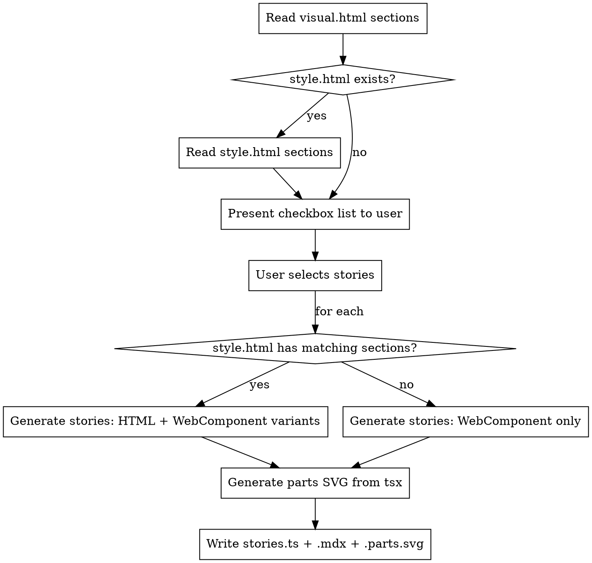

# Write Component Docs

Generates exactly **one** `<component>.stories.ts` and **one** `<component>.mdx` per component in `docs/src/components/<component>/`. All selected stories are exports inside the single stories file; all Canvas blocks are sections inside the single MDX file.

## Process



## Step 1 — Read HTML sections

Parse `data-testid` attributes from `<section>` elements in:

- `packages/core/src/components/<component>/test/<component>.visual.html` — web component markup
- `packages/core/src/components/<component>/test/<component>.style.html` — CSS-only HTML (if exists)

## Step 2 — Present checkbox list

Show ALL sections from `visual.html` as a numbered checkbox list:

```
Which sections should become stories?

[ ] 1. basic
[ ] 2. disabled
[ ] 3. invalid
[ ] 4. colors
...

(enter numbers separated by commas, or "all")
```

Wait for user selection before proceeding.

## Step 3 — Generate ONE `<component>.stories.ts`

**One file. All selected story exports go inside it.**

### Meta block (always present)

```typescript
import type { JSX } from '@baloise/ds-core'
import type { Meta } from '@storybook/html-vite'
import { props, StoryFactory, withComponentControls, withContent, withDefaultContent, withRender } from '../../utils'

type Args = JSX<PascalCaseTag> & { content: string }

const tag = '<ds-component>'

const meta: Meta<Args> = {
  title: 'Components/<Category>/<Name>',
  args: {
    ...withDefaultContent(),
  },
  argTypes: {
    ...withContent(),
    ...withComponentControls({ tag }),
  },
  ...withRender(({ content, ...args }) => `<ds-component ${props(args)}>${content}</ds-component>`),
}

export default meta

const Story = StoryFactory<Args>(meta)
```

### Story naming — web component is the default

**Web component stories** use the plain PascalCase export name. The display name is set via `storyName` with the emoji at the **end**.
**HTML/CSS stories** use the plain name + `Html` suffix. Same pattern with 🌍 at the end.

**Never use `name:` inside the `Story({})` config object.** Always set the display name via `ExportName.storyName` after the story definition.

```typescript
// Web component variant
export const Basic = Story({
  ...withRender(({ content, ...args }) => `<ds-component ${props(args)}>${content}</ds-component>`),
})
Basic.storyName = '🧩 Basic'

// HTML/CSS variant
export const BasicHtml = Story({
  ...withRender(() => `<!-- inner HTML from style.html basic section -->`),
})
BasicHtml.storyName = '🌍 Basic'
```

If `style.html` doesn't exist, export only the web component story (no `Html` variant):

```typescript
export const Slots = Story({
  ...withRender(() => `<!-- inner HTML from visual.html slots section -->`),
})
Slots.storyName = '🧩 Slots'
```

### Additional stories

For each selected section (after basic):

- **If matching section exists in `style.html`**: two exports — `<SectionName>` (WC, 🧩) and `<SectionName>Html` (CSS/HTML from style.html, 🌍)
- **If no match in `style.html`**: one export using web component markup from visual.html (🧩 only)

Inner HTML comes directly from the respective HTML file section — copy it verbatim, stripping only the outer `<section>` wrapper and `<span>` label.

## Step 3.5 — Generate `<component>.parts.svg`

Read `packages/core/src/components/<component>/<component>.tsx` and collect every `part="…"` attribute value, the HTML element it sits on, and its nesting position inside `render()`.

### Color assignment (design-token primitives)

Assign one of four color families by conceptual role. Each family provides: zone bg (shade 1), zone stroke (shade 3–4), badge fill (shade 5), badge text = white.

| Role                                               | Color      | bg        | stroke    | badge     |
| -------------------------------------------------- | ---------- | --------- | --------- | --------- |
| Host wrapper (`ds-*`)                              | **Purple** | `#F9F3FF` | `#B8B2FF` | `#9F52CC` |
| Outermost container part                           | **Yellow** | `#FFF9E8` | `#FFBE19` | `#FA9319` |
| List / content container part                      | **Green**  | `#E9FBF7` | `#21D9AC` | `#00B28F` |
| Interactive controls (buttons, inputs, indicators) | **Red**    | `#FFEEF1` | `#FF596F` | `#D9304C` |

If fewer than four roles exist, skip Red and use Purple → Yellow → Green. Part name text colour in the reference table matches the badge colour (shade 5 for readability on white).

Additional shades for element states:

- Inactive control: white bg, Green-3 stroke `#94E3D4`
- Active/selected control: Green-5 fill `#00B28F`, white text
- Muted indicator (ellipsis etc.): shade-1 bg + shade-2 stroke of its family

### SVG layout rules

- Canvas width: **880px**. Height: calculated (host zone + callout area only — no table).
- **No title, no table** — the title `## Parts` and the reference table are written in the MDX file.
- Nested container parts render as dashed-border rectangles, innermost first.
- Each zone has a pill badge (`part="name"`) anchored to its top-left border edge.
- Leaf parts (buttons, divs) render as individual element boxes inside their parent zone.
- If a leaf part has two visual states (active/inactive), show both side by side. Drop a dashed callout line from each to a pill label below: `part="name" inactive` / `part="name" active`.

### SVG structure template

```xml
<?xml version="1.0" encoding="UTF-8"?>
<!--
  Design token primitives:
  Purple  1:#F9F3FF  2:#E1D9FF  3:#B8B2FF  5:#9F52CC  6:#6C2273
  Yellow  1:#FFF9E8  2:#FFECBC  3:#FAE052  4:#FFBE19  5:#FA9319  6:#B24A00
  Red     1:#FFEEF1  2:#FFD7D7  3:#FFACA6  4:#FF596F  5:#D9304C  6:#99172D
  Green   1:#E9FBF7  2:#CBF2EC  3:#94E3D4  4:#21D9AC  5:#00B28F  6:#1B5951
-->
<svg xmlns="http://www.w3.org/2000/svg" width="880" height="{H}" viewBox="0 0 880 {H}">
  <defs>
    <filter id="shadow" x="-10%" y="-10%" width="120%" height="120%">
      <feDropShadow dx="0" dy="1" stdDeviation="2" flood-opacity="0.10"/>
    </filter>
  </defs>
  <rect width="880" height="{H}" fill="#ffffff"/>

  <!-- host zone (Purple) -->
  <!-- container part zones (Yellow, Green) -->
  <!-- leaf part boxes (Red for controls, Green for list items) -->
  <!-- callout lines + state pills (when applicable) -->
  <!-- NO table — table goes in the MDX as markdown -->
</svg>
```

Write the finished SVG to `docs/src/components/<component>/<component>.parts.svg`.

## Step 4 — Generate ONE `<component>.mdx`

**One file. All selected story Canvas blocks go inside it as sections.**

### Fixed structure

```mdx
import { Canvas, Markdown, Meta } from '@storybook/addon-docs/blocks'
import { Banner, BasicStoryTabs, Footer, Lead, PlaygroundBar, StoryHeading, TokenOverview } from '../../../.storybook/blocks'
import * as <ComponentName>Stories from './<component>.stories'

<Meta of={<ComponentName>Stories} />

<StoryHeading of={<ComponentName>Stories.Basic} hidden></StoryHeading>

<Banner of={<ComponentName>Stories} />

<Lead>**<ComponentName>** [one-line description — ask user if not obvious]</Lead>

<BasicStoryTabs tag="<component-name>" htmlStory={<ComponentName>Stories.BasicHtml} webComponentStory={<ComponentName>Stories.Basic} index={1} />

<PlaygroundBar of={<ComponentName>Stories.Basic}></PlaygroundBar>
```

`index={1}` on `BasicStoryTabs` makes the Web Component tab the default (shown first).

If `style.html` doesn't exist (web component only), replace `BasicStoryTabs` with:

```mdx
<Canvas of={<ComponentName>Stories.Basic} sourceState={'shown'} />
```

### Story sections

For each selected story (after basic) **with both HTML and WC variants**, use `BasicStoryTabs` with `noGuide`:

```mdx
{/* ------------------------------------------------------ */}

<StoryHeading of={<ComponentName>Stories.<StoryName>}></StoryHeading>

<BasicStoryTabs tag="<component-name>" htmlStory={<ComponentName>Stories.<StoryName>Html} webComponentStory={<ComponentName>Stories.<StoryName>} index={1} noGuide />
```

For sections with **WC only** (no matching style.html section):

```mdx
{/* ------------------------------------------------------ */}

<StoryHeading of={<ComponentName>Stories.<StoryName>}></StoryHeading>

<Canvas of={<ComponentName>Stories.<StoryName>} sourceState={'shown'} />
```

### Fixed footer (always at end)

**Web-component-only** (no `style.html` — single `## Accessibility` section):

```mdx
{/* ------------------------------------------------------ */}

## Component API

import api from './api.md?raw'

<Markdown>{api}</Markdown>

## Parts

import <ComponentName>Parts from './<component>.parts.svg'

Parts} alt="<ComponentName> parts diagram" />

<Markdown>
  {`
| Part | Element | Purpose |
| --- | --- | --- |
| \`part-name\` | \`<element>\` | Description. |
`}
</Markdown>

## CSS Variables

<TokenOverview component="<component-name>" />

## Integration

import integration from '../../snippets/integration.md?raw'

<Markdown>{integration}</Markdown>

## Accessibility

_TODO: run the `add-component-a11y-docs` skill to generate this section._

<Footer />
```

**Hybrid component** (`style.html` exists — split into two subsections):

```mdx
## Accessibility

### HTML / CSS only

_TODO: run the `add-component-a11y-docs` skill to generate this section._

### Web component

_TODO: run the `add-component-a11y-docs` skill to generate this section._

<Footer />
```

### Accessibility content principle

The `## Accessibility` section documents **consumer requirements only** — what the user of the library must do or be aware of. It must **not** describe internal component implementation details (which ARIA attributes the component sets, which elements it renders, how slots work internally).

Write each point as an actionable instruction directed at the consumer:

```
✓ Add an `aria-label` to the parent element when using an icon-only badge.
✗ The icon prop renders a ds-icon with aria-hidden="true".
```

After generating the MDX file, immediately invoke the `add-component-a11y-docs` skill to fill in the Accessibility section.

## Naming Conventions

| Section `data-testid`  | WC export            | `storyName`                 | HTML export              | `storyName`                 |
| ---------------------- | -------------------- | --------------------------- | ------------------------ | --------------------------- |
| `basic`                | `Basic`              | `'🧩 Basic'`                | `BasicHtml`              | `'🌍 Basic'`                |
| `no-wrap`              | `NoWrap`             | `'🧩 No Wrap'`              | `NoWrapHtml`             | `'🌍 No Wrap'`              |
| `be-enterprise-number` | `BeEnterpriseNumber` | `'🧩 Be Enterprise Number'` | `BeEnterpriseNumberHtml` | `'🌍 Be Enterprise Number'` |

- Convert kebab-case testid to PascalCase for export names
- WC stories: plain PascalCase export + `ExportName.storyName = '🧩 Label'`
- HTML stories: PascalCase + `Html` suffix + `ExportName.storyName = '🌍 Label'`
- Emoji goes at the **start** of the storyName string

## Key Patterns from Existing Stories

- `withDefaultContent()` provides the `content` arg (slot text)
- `withContent()` / `withComponentControls({ tag })` populate argTypes
- `withRender(fn)` wraps the render function
- `props(args)` serialises Stencil props to HTML attribute string
- `cssClasses({...}, args, 'base-class')` maps props to CSS modifier classes (needed when CSS story has modifier logic)
- `createCssMappings(tag)` + `css(prop, fn)` for CSS class mappings — only needed when the HTML-only story has dynamic modifiers
- `StoryFactory<Args>(meta)` returns the `Story()` helper
- Story inner HTML should be the raw section content, not wrapped in `<section>`

## Output — exactly three files per component

| File                                                     | Contents                                                                                     |
| -------------------------------------------------------- | -------------------------------------------------------------------------------------------- |
| `docs/src/components/<component>/<component>.stories.ts` | `meta` default export + ALL selected story named exports                                     |
| `docs/src/components/<component>/<component>.parts.svg`  | Parts anatomy diagram (880px, no title, token primitive colours, Part/Element/Purpose table) |
| `docs/src/components/<component>/<component>.mdx`        | Banner, BasicStoryTabs/Canvas, story sections, API, Parts diagram, TokenOverview, footer     |

**Never create separate files per story.** Create the `docs/src/components/<component>/` directory if it doesn't exist. Do NOT create or edit `api.md` (auto-generated by Stencil).
