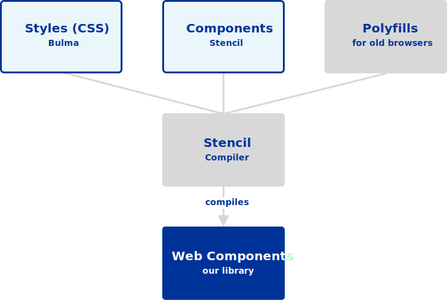
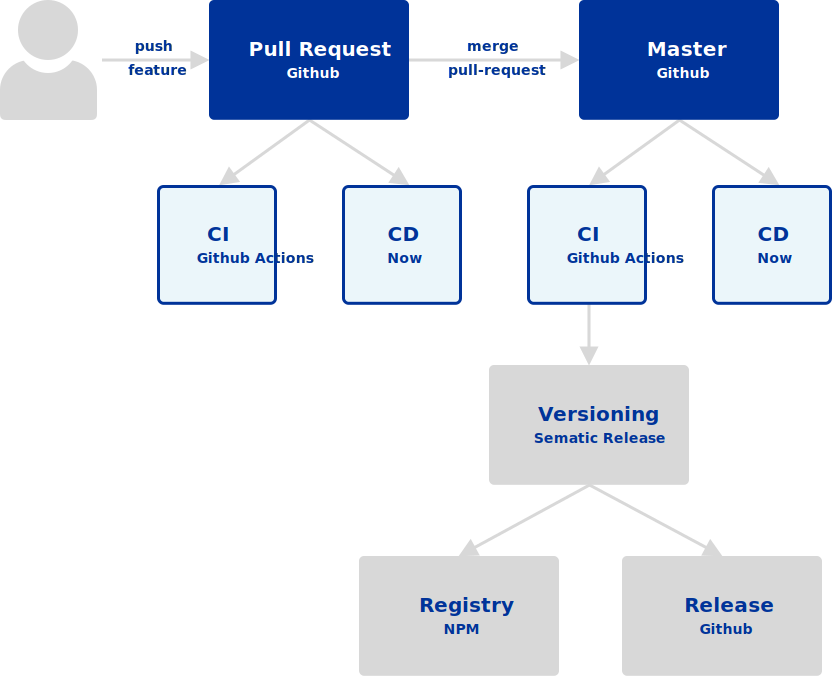

# Architecture

The UI-Libary is an open source project for styling awesome web applications that follow the Baloise corporate styling guidelines.

The architecture is based on web standards and best practices. Moreover, we try to keep it as simple as possible for our contributors and consumers.
For those reasons we decided to use Web Components, which are supported by all modern browsers. The project fully supports [TypeScript](https://www.typescriptlang.org/).

## Libraries

Under the hood, UI-Libary uses [Bulma](https://bulma.io/), a clean css framework, and [Stencil](https://stenciljs.com/) as Web Components Compiler. At the end everything will be compiled in a clean web component without any framework specific code.

> The best part is that we depend on only those two libraries, which do not depend on each other, and at the end we have only one simple UI-Library for our consumers!

 

| Libary                                                       | Description                                                                                                                                                                                                                                                                                                                                |
| ------------------------------------------------------------ | ------------------------------------------------------------------------------------------------------------------------------------------------------------------------------------------------------------------------------------------------------------------------------------------------------------------------------------------ |
| [Web Components](https://www.webcomponents.org/introduction) | Web components are a set of web platform APIs that allow you to create new custom, reusable, encapsulated HTML tags to use in web pages and web apps. Custom components and widgets build on the Web Component standards, will work across modern browsers, and can be used with any JavaScript library or framework that works with HTML. |
| [Bulma](https://bulma.io/)                                   | The Bulma framework is a free CSS solution based on the Flexbox layout. With Bulma, the extensive range of built-in features means faster turnaround and less CSS code writing.                                                                                                                                                            |
| [Stencil](https://stenciljs.com/)                            | A Web Component compiler for building fast, reusable UI components and Progressive Web Apps.                                                                                                                                                                                                                                               |

 
<h3 id="bulma">
    
</h3>

Bulma is fully open-source lightweight CSS (Cascading Style Sheets) solution based on the Flexbox layout.

#### Here are some advantages

##### Easy to learn

Bulmas components are well-documented and have simplified css classes. Every class name is human readable. Moreover, they provide some really good starter templates.

##### CSS only

At the end Bulma is just one CSS file (bulma.css). However, if you just want to use a part of it import the individual .sass source files.

##### Responsive

Bulma is designed as a mobile-first CSS framework, offering optimum site responsiveness. Build a site once and watch it work across any device.

##### Well documented

The [Documentation](https://bulma.io/documentation/) helps you getting the most out of this framework. There are a lot examples for each component.

##### Modular

Bulma is not an all in one framework. It is modular, which means you can only import those components that you need. For that just import the individual sass file.

##### Customizable

Of cource, not everyone likes the theme of bulma. No problem, just import the variables.scss file and change the colors. Each component has its own sass variables, which can be easily changed to design a new theme.

 

#### SWOT analyse of Bulma

 
<table class="docs-swot-table">
    <tr>
        <th></th>
        <th class="green">
            <strong>Helpful</strong> 
            <small>to achieving the objective</small>
        </th>
        <th class="red">
            <strong>Harmful</strong> 
            <small>to achieving the objective</small>
        </th>
    </tr>
    <tr>
        <th class="yellow rotate">
            

                <strong>Internal origin</strong> 
                <small>(product/company attributes)</small>
            

        </th>
        <td>
            <strong>Strengths</strong>
            <ul>
                <li>Easy to learn</li>
                <li>CSS only</li>
                <li>Responsive</li>
                <li>Well documented</li>
                <li>Modular</li>
                <li>Customizable</li>
            </ul>
        </td>
        <td>
            <strong>Weakness</strong>
            <ul>
                <li>Depending on the release cycle of Bulma</li>
            </ul>
        </td>
    </tr>    
    <tr>
        <th class="blue rotate">
            

                <strong>External origin</strong> 
                <small>(environment/market attributes)</small>
            

        </th>
        <td>
            <strong>Opportunity</strong>
            <ul>
                <li>Framework agnostic</li>
                <li>Open-Source positioning</li>
                <li>Get new components</li>
            </ul>
        </td>
        </td>
        <td>
            <strong>Threat</strong>
            <ul>
                <li>Library could get deprecated</li>
            </ul>
        </td>
        </td>
    </tr>
</table>

 
<h3 id="stencil">
    
</h3>

This is not another framework. It is a compiler that generates standards-based [Web Components](https://developer.mozilla.org/en-US/docs/Web/Web_Components) (more specifically, Custom Elements). They can be used without any framework, because they are just [Web Components](https://developer.mozilla.org/en-US/docs/Web/Web_Components).

With Stencil we are able to develop universal, framework and library agnostic UI elements that can be shared among different projects.

#### Here are some advantages

##### Future Friendly

We don't know which is going to be the next big framework on the horizon, but with Stencil we do not have to care. Stencil does not depend on any framework. As mentioned above it is a compiler to generate standards-based [Web Components](https://developer.mozilla.org/en-US/docs/Web/Web_Components), which can be used with any framework.

##### TypeScript Support

TypeScript helps maintaining the code. Additionally, Stencil generates types for the components, which helps during developement.

##### Browser Support

For the small minority of browsers that do not support modern browser features and APIs, Stencil will automatically polyfill them on-demand.
Out-of-the-box browser support includes all modern browsers starting from Internet Explorer 11 ([Browser Support](https://stenciljs.com/docs/browser-support)).

##### Easy to learn

The tiny API and concepts, which are based on web standards, are quite simular to the concepts and APIs of the major JavaScript frameworks like React, Vue and Angular. So it is really simple to get started. The goal is not to create yet-another-framework, but rather provide tooling for developers to generate future-friendly components using APIs already baked within the browser.

##### Needs no dependencies at runtime

The generated code does not rely on Stencil, but rather it generates highly-optimized, framework-free, stand-alone code which runs natively in the browser.

 

#### SWOT analyse of Stencil

 
<table class="docs-swot-table">
    <tr>
        <th></th>
        <th class="green">
            <strong>Helpful</strong> 
            <small>to achieving the objective</small>
        </th>
        <th class="red">
            <strong>Harmful</strong> 
            <small>to achieving the objective</small>
        </th>
    </tr>
    <tr>
        <th class="yellow rotate">
            

                <strong>Internal origin</strong> 
                <small>(product/company attributes)</small>
            

        </th>
        <td>
            <strong>Strengths</strong>
            <ul>
                <li>Future Friendly</li>
                <li>TypeScript Support</li>
                <li>Browser Support</li>
                <li>Easy to learn</li>
                <li>Needs no dependencies at runtime</li>
                <li>Web Standards</li>
                <li>Automatic Optimizations</li>
                <li>Run-time Performance</li>
                <li>Framework Features During Development</li>
            </ul>
        </td>
        <td>
            <strong>Weakness</strong>
            <ul>
                <li>Depending on the release cycle of Stencil</li>
            </ul>
        </td>
    </tr>    
    <tr>
        <th class="blue rotate">
            

                <strong>External origin</strong> 
                <small>(environment/market attributes)</small>
            

        </th>
        <td>
            <strong>Opportunity</strong>
            <ul>
                <li>Framework agnostic</li>
                <li>Open-Source positioning</li>
                <li>Get new features</li>
                <li>Web Standards</li>
                <li>Only ships Web Components</li>
            </ul>
        </td>
        </td>
        <td>
            <strong>Threat</strong>
            <ul>
                <li>Library could get deprecated</li>
            </ul>
        </td>
        </td>
    </tr>
</table>

## CI & CD

> We use opensource tooling to make our processes simpler

We use Github as our software development platform, which is the leading platform for open-spource projects in the world.
For new features or fixes we develop them in seperate branches which will result in a pull-request. Github Actions, our CI tool, listens on webhooks and starts building & testing our application in a seperate container. Moreover, our deployment platform Now also listens for fired webhooks and automatically deploys the code of the pull request to a preview environment. All this is shown in the open pull request on Github. So other developers and UX specialists can easly review, comment, approve or decline the new changes.

After a pull request has been approved, it will be merged into master, which is our default branch. github Actions reacts on the merge action and starts its configured workflow. There is a slide diffrence to other builds, which is the release part. The release process is fully automated with sematic release.
Based on the commit messages since the last release, it detects the release type (major, minor or patch).

| Commit message                                                                                                                                                                                   | Release type               |
| ------------------------------------------------------------------------------------------------------------------------------------------------------------------------------------------------ | -------------------------- |
| `fix(pencil): stop graphite breaking when too much pressure applied`                                                                                                                             | Patch Release              |
| `feat(pencil): add 'graphiteWidth' option`                                                                                                                                                       | ~~Minor~~ Feature Release  |
| `perf(pencil): remove graphiteWidth option`  `BREAKING CHANGE: The graphiteWidth option has been removed.` `The default graphite width of 10mm is always used for performance reasons.` | ~~Major~~ Breaking Release |

After detecting the new version, it also publishes the library to npm. Afterthat, it releases it on Github with a nice changelog, which is generated based on the commit messages. Finally, it gets deployed to the production environment of now.

 

 

| Tool                                    | Description                                                             |
| --------------------------------------- | ----------------------------------------------------------------------- | --- |
| [Github](https://github.com/)           | Is the world's leading software development platform.                   |     |
| [NPM](https://www.npmjs.com/)           | Software Registry of all the JavaScript & TypeScript packages.          |
| [Now](https://zeit.co/)                 | ZEIT Now is a cloud platform for static sites and Serverless Functions. |
| [Lerna](https://github.com/lerna/lerna) | A tool for managing JavaScript projects with multiple packages.         |
