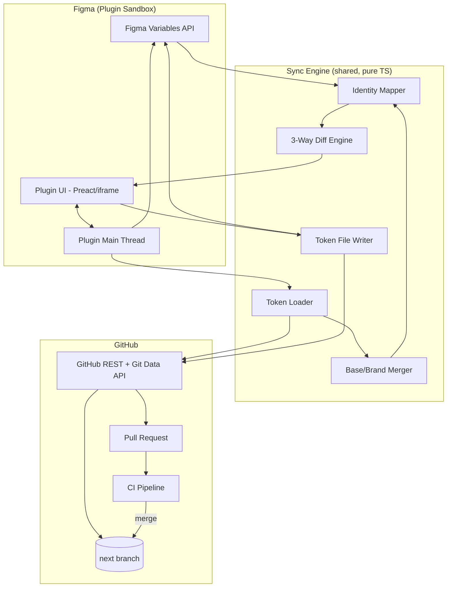
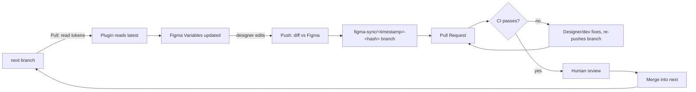
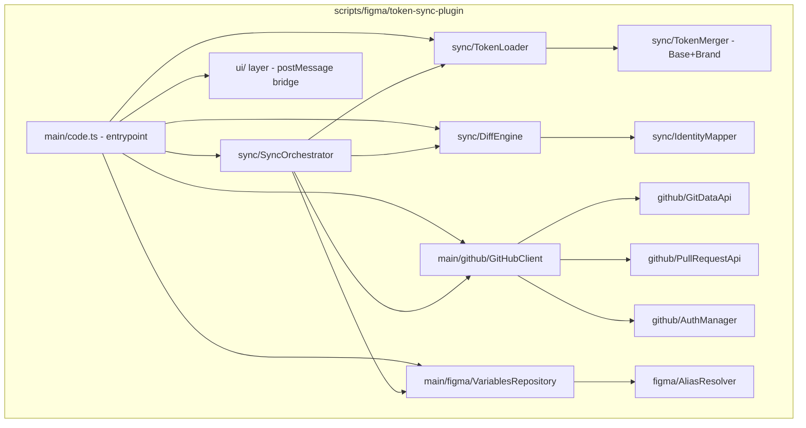
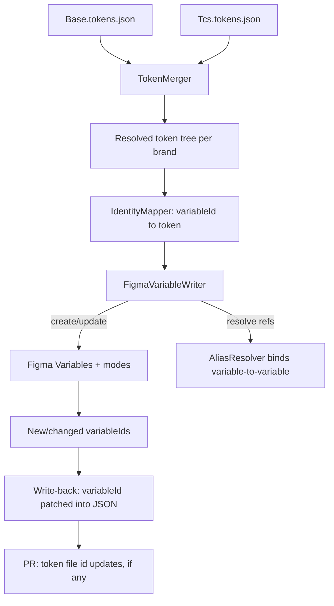

# Figma Token Sync Plugin — Implementation Plan

Status: proposed, scope amended by [ADR 0016](../adr/0016-github-action-supersedes-plugin-pull.md) · Owner: packages/tokens · Related: [ADR 0011](../adr/0011-figma-variable-identity-key.md), [ADR 0012](../adr/0012-brand-modes-not-collections.md), [ADR 0013](../adr/0013-native-variable-aliasing.md), [ADR 0014](../adr/0014-git-data-api-atomic-commits.md), [ADR 0015](../adr/0015-git-committed-sync-baseline.md), [ADR 0016](../adr/0016-github-action-supersedes-plugin-pull.md)

> **Scope amendment (2026-08-06):** Pull (from Code) — originally Phase 2
> below — is no longer part of this plugin. It's owned by the Figma Sync
> GitHub Action instead; see [ADR 0016](../adr/0016-github-action-supersedes-plugin-pull.md).
> The plugin's scope is now Phase 1 (read-only diff status) and Phase 3
> (Push, Figma→GitHub) only. Phase 2 is kept below, struck through, for
> historical context — the data model and diagrams it describes now live
> in the Action instead.

## 1. Purpose

Keep Figma Variables and `packages/tokens/tokens/*.tokens.json` in sync
through GitHub Pull Requests, while staying fully compatible with the
Design Tokens Format Module 2025.10, since Style Dictionary and Figma's own
token importer both depend on that format. The plugin itself now covers
only two of the three sync legs — read-only diff status, and Push
(Figma→GitHub) — with Pull (GitHub→Figma) handled automatically by a
separate GitHub Action ([ADR 0016](../adr/0016-github-action-supersedes-plugin-pull.md)).

This document is an MVP plan. Naming validation, linting, conflict
_resolution_ (only conflict _detection and display_ is in scope), token
usage analysis, and approval workflows beyond GitHub PR review are
explicitly out of scope — see [§8 Future Extensions](#8-future-extensions).

## 2. Governing decisions

These were resolved before drafting this plan and are treated as fixed
constraints throughout:

| Decision              | Resolution                                                                                               |
| --------------------- | -------------------------------------------------------------------------------------------------------- |
| Plugin location       | Inside this monorepo, `scripts/figma/token-sync-plugin/`                                                 |
| Brand ↔ Figma mapping | Modes within one Variable Collection ([ADR-0012](../adr/0012-brand-modes-not-collections.md))               |
| Token identity        | `variableId` primary, path fallback ([ADR-0011](../adr/0011-figma-variable-identity-key.md))                |
| Metadata location     | Separate `.figma-sync-state.json`, not inline `$extensions`                                              |
| Branch strategy       | New branch + PR per sync session                                                                         |
| PAT type              | Classic or fine-grained accepted; scopes validated on connect                                            |
| Fetch trigger         | Manual "Check for updates," not automatic on plugin open                                                 |
| Diff strategy         | 3-way diff against a stored sync baseline                                                                |
| Brand file writes     | Push strips to true overrides only (mirrors `computeTokenDiff`)                                          |
| Reference handling    | Native Figma variable aliases, not flattened literals ([ADR-0013](../adr/0013-native-variable-aliasing.md)) |
| Baseline storage      | Committed to GitHub, not local `clientStorage` ([ADR-0015](../adr/0015-git-committed-sync-baseline.md))     |
| GitHub write API      | Git Data API, one atomic commit per sync ([ADR-0014](../adr/0014-git-data-api-atomic-commits.md))           |
| Deletion safety       | Extra confirmation step, excluded from "Apply All"                                                       |
| Rollout scope         | Single-designer pilot for Phases 1–3; concurrency hardening in Phase 5                                   |
| UI stack              | TypeScript + Preact, bundled with esbuild                                                                |

## 3. Architecture

### 3.1 High-level architecture



### 3.2 Synchronization sequence (Push to Code, the more complex direction)

```mermaid
sequenceDiagram
    actor D as Designer
    participant UI as Plugin UI
    participant M as Plugin Main
    participant FV as Figma Variables API
    participant GH as GitHub API

    D->>UI: Open plugin
    UI->>M: Load cached sync-state (last baseline)
    M-->>UI: Render last-known status (no fetch)
    D->>UI: Click "Check for updates"
    M->>GH: Fetch tokens + .figma-sync-state.json (next branch)
    M->>FV: Read local Variables + modes
    M->>M: 3-way diff (baseline vs Figma vs GitHub)
    M-->>UI: Render diff table (per-token change type)
    D->>UI: Select changes, confirm deletions separately
    D->>UI: Click "Push to GitHub"
    UI->>D: Prompt for PR title / description
    M->>M: Recompute brand overrides (strip identical-to-base)
    M->>M: Resolve variable aliases back to {Reference} strings
    M->>GH: Create branch from next
    M->>GH: Create blobs (token files + sync-state)
    M->>GH: Create tree, commit, update ref
    M->>GH: Open Pull Request
    GH-->>D: PR link
    Note over GH: CI validates; human reviews; merge into next
```

### 3.3 GitHub workflow



### 3.4 Component diagram



### 3.5 Data flow (Pull from Code)



## 4. Project structure

```
scripts/figma/token-sync-plugin/
├── manifest.json                  # Figma plugin manifest (networkAccess: api.github.com)
├── build.mjs                      # esbuild bundler (main thread + ui bundle)
├── package.json
├── src/
│   ├── main/                      # Runs in Figma's plugin sandbox (no DOM)
│   │   ├── code.ts                # Entry point, message routing to/from UI
│   │   ├── figma/
│   │   │   ├── VariablesRepository.ts   # Wraps figma.variables.* calls
│   │   │   ├── AliasResolver.ts         # Reference <-> VariableAlias binding
│   │   │   └── ModeManager.ts           # Brand <-> mode mapping (ADR-0012)
│   │   └── github/
│   │       ├── GitHubClient.ts          # High-level facade
│   │       ├── GitDataApi.ts            # blob/tree/commit/ref (ADR-0014)
│   │       ├── PullRequestApi.ts
│   │       ├── AuthManager.ts           # PAT storage, scope validation
│   │       └── RateLimiter.ts           # backoff + conditional requests
│   ├── sync/                      # Pure TypeScript, no Figma/DOM/network APIs
│   │   ├── TokenLoader.ts               # Parses *.tokens.json
│   │   ├── TokenMerger.ts               # Base + brand inheritance resolution
│   │   ├── IdentityMapper.ts            # variableId <-> token path matching
│   │   ├── DiffEngine.ts                # 3-way diff against baseline
│   │   ├── BrandWriter.ts               # Strips identical-to-base on write
│   │   └── SyncOrchestrator.ts          # Coordinates a full Pull or Push
│   ├── domain/                    # Types shared across all layers
│   │   ├── Token.ts
│   │   ├── SyncState.ts
│   │   ├── DiffEntry.ts
│   │   └── ChangeType.ts
│   └── ui/                        # Runs in the plugin's iframe (Preact)
│       ├── ui.tsx
│       ├── DiffTable.tsx
│       ├── ChangeRow.tsx
│       ├── PrForm.tsx
│       └── AuthPanel.tsx
└── test/
    ├── sync/                      # Unit tests for pure logic (majority of coverage)
    └── fixtures/                  # Sample token trees, sample Figma variable dumps
```

**Service boundaries**: `sync/` has zero dependency on `figma.*` globals or
`fetch` — it operates on plain data structures (`Token[]`, `FigmaVariableSnapshot[]`,
`SyncState`) so the diff/merge/identity logic is unit-testable in plain
Node/Vitest without a Figma runtime or network mocking. `main/figma/` and
`main/github/` are the only two places that touch an external API; `code.ts`
composes them via `SyncOrchestrator` and never calls either API directly
itself.

**Repository abstraction**: `GitHubClient` is the only consumer-facing
surface; `GitDataApi` and `PullRequestApi` are internal collaborators. This
keeps `SyncOrchestrator` and everything above it ignorant of REST vs. Git
Data API mechanics, which matters if [multi-provider support](#8-future-extensions)
is ever added.

## 5. Data model

### 5.1 Token (domain type, independent of Figma or GitHub)

```ts
interface Token {
  path: string[] // e.g. ["🔗 Alias", "🎨 Background", "Color", "Sky"]
  type: string // $type
  value: TokenValue // literal, or a Reference
  variableId?: string // $extensions["com.figma.variableId"], absent until first sync
  figmaScopes?: string[] // $extensions["com.figma.scopes"]
}

type TokenValue = { kind: 'literal'; value: unknown } | { kind: 'reference'; path: string[] } // {Global.Color.Primary.2}
```

### 5.2 Figma Variable identity mapping

Identity is not a separate table (ADR-0011) — it is carried on the token
via `variableId`. The `IdentityMapper` builds an in-memory lookup for a
sync session only:

```ts
interface IdentityIndex {
  byVariableId: Map<string, Token>
  byPath: Map<string, Token> // fallback for tokens with no variableId yet
}
```

### 5.3 Sync state (`.figma-sync-state.json`, committed — ADR-0005)

```ts
interface SyncState {
  lastSyncedCommit: string // GitHub commit SHA this baseline reflects
  lastSyncedAt: string // ISO 8601
  entries: Record<
    string /* variableId */,
    {
      tokenPath: string[]
      resolvedValue: unknown // value at last sync, post brand-resolution
      lastModifiedSource: 'code' | 'figma'
      lastModifiedAt: string
    }
  >
}
```

This file is sync bookkeeping, not Design Tokens Format content — it's
excluded from Style Dictionary's `source` globs and from anything that
treats `*.tokens.json` as spec-compliant token data.

### 5.4 Diff model

```ts
type ChangeType = 'added' | 'deleted' | 'renamed' | 'value-changed' | 'reference-changed' | 'conflict'

interface DiffEntry {
  variableId?: string
  tokenPath: string[]
  changeType: ChangeType
  figmaValue: unknown
  githubValue: unknown
  baselineValue?: unknown // present when a conflict determination needed it
  requiresExplicitConfirm: boolean // true for 'deleted'
}
```

`conflict` is derived, not detected directly: both `figmaValue` and
`githubValue` differ from `baselineValue`, and from each other. A one-sided
change (only one side differs from baseline) is `value-changed`,
`added`, `deleted`, or `renamed` depending on which fields are present.

## 6. Multi-brand inheritance, end to end

| Step                        | Behavior                                                                                                                                                                                                                                                                                                                                                                             |
| --------------------------- | ------------------------------------------------------------------------------------------------------------------------------------------------------------------------------------------------------------------------------------------------------------------------------------------------------------------------------------------------------------------------------------ |
| **Loading**                 | `Base.tokens.json` and each brand file are loaded independently; brand files are _not_ assumed complete — `TokenLoader` never fails on a brand file missing a token that exists in Base.                                                                                                                                                                                             |
| **Merging**                 | `TokenMerger` produces one resolved tree per brand: Base values overlaid with brand overrides, following the exact recursive-diff shape already implemented in `src/config.brand.ts`'s `computeTokenDiff` (kept as the shared reference implementation rather than reinvented).                                                                                                      |
| **Synchronization (Pull)**  | Every brand's resolved tree is written into its Figma mode. Non-overridden tokens get Base's value copied into the brand mode (Figma requires an explicit per-mode value — see [ADR-0012](../adr/0012-brand-modes-not-collections.md)); this copy is not tagged as anything special in `SyncState` — its "is this a real override" status is re-derived by comparison at the next Push. |
| **Diff generation**         | The diff engine runs per-brand-mode against the corresponding brand's baseline entries. A token that's identical across Base and a brand never appears in that brand's diff, even if it appears in Base's.                                                                                                                                                                           |
| **Writing updated files**   | Push recomputes, per brand, which mode-values differ from the resolved Base value (mirroring `computeTokenDiff`) and writes only those to the brand's `*.tokens.json` — never a full resolved copy (locked in as a deliberate choice, not just the Style Dictionary build's tolerance of one).                                                                                       |
| **Pull Request generation** | A single PR can span multiple brand files plus the sync-state file in one commit (Git Data API, ADR-0004); the diff table groups changes by brand so a reviewer can see "this PR touches Base and Tcs" at a glance.                                                                                                                                                                  |

## 7. Phased implementation

### Phase 0 — Foundation (no user-facing sync yet)

**Objectives**: stand up the plugin skeleton, GitHub auth, and the pure
sync engine with full test coverage, without wiring it to real Figma
Variable writes yet.

**Features delivered**: plugin loads in Figma, PAT entry + scope
validation, read-only token loading from GitHub, `TokenMerger` and
`IdentityMapper` with fixture-based unit tests.

**Technical architecture**: `main/github/AuthManager` + `GitHubClient`
(read-only calls only), `sync/TokenLoader`, `sync/TokenMerger`. No
`Figma Variables` writes.

**Required GitHub APIs**: `GET /repos/{owner}/{repo}/contents/{path}` (or
`git/trees` for a full-tree read), `GET /user` (PAT validation),
`GET /repos/{owner}/{repo}` (permission check).

**Required Figma Plugin APIs**: `figma.clientStorage` (PAT storage),
`figma.showUI`.

**Data flow**: GitHub → `TokenLoader` → `TokenMerger` → in-memory resolved
tree, displayed as raw JSON in a debug panel (not the real diff UI yet).

**Milestones**: (1) PAT stored/validated, (2) token files fetched and
parsed, (3) `TokenMerger` output matches `computeTokenDiff`'s CSS output on
all existing tokens (cross-checked against current `pnpm tokens` build).

**Risks**: Design Tokens Format edge cases in existing token data (emoji
keys, unusual `$type`s) not anticipated by the merger — mitigate by
fixturing the _actual_ `Base.tokens.json`/`Tcs.tokens.json` in tests, not
synthetic samples.

**Open questions**: exact PAT scope-validation UX when a classic PAT is
over-scoped (warn vs. block) — deferred to Phase 5 hardening, not blocking
here.

**Expected outcome**: a plugin that can authenticate and correctly resolve
the full multi-brand token tree, provably matching current build output,
with zero Figma Variable mutation risk.

---

### Phase 1 — Sync Status (read-only diff)

**Objectives**: designers can see what's out of sync, with zero write
capability — de-risks the diff/mapping engine before any mutation logic
exists.

**Features delivered**: "Check for updates" button, 3-way diff table
(added/deleted/renamed/changed/conflict), grouped by brand, no apply
actions yet (buttons visibly disabled/"coming soon").

**Technical architecture**: `main/figma/VariablesRepository` (read-only:
`getLocalVariablesAsync`, `getVariableCollectionsAsync`),
`sync/DiffEngine`, `ui/DiffTable.tsx`. `.figma-sync-state.json` is read but
not yet written (bootstrapped as empty/absent — see Phase 1 open question
below).

**Required GitHub APIs**: same as Phase 0, plus reading
`.figma-sync-state.json` (tolerating its absence on first-ever run).

**Required Figma Plugin APIs**: `figma.variables.getLocalVariablesAsync()`,
`figma.variables.getVariableCollectionsAsync()`.

**Data flow**: Figma Variables + GitHub tokens + stored baseline →
`DiffEngine` → `DiffEntry[]` → `DiffTable`.

**Milestones**: (1) diff table renders real change types against the
current production token set and an unmodified Figma file (expect: mostly
"in sync," since today's Figma state was hand-exported), (2) manually
edited Figma Variables correctly surface as `value-changed`/`conflict`.

**Risks**: no real baseline exists yet for the _current_ hand-maintained
Figma file — first run has no `SyncState` to 3-way-diff against, so Phase 1
must degrade gracefully to a 2-way diff (Figma vs. GitHub) until Phase 2's
first Pull establishes a genuine baseline.

**Open questions**: what exactly bootstraps `.figma-sync-state.json` for
the very first sync — proposed answer is that Phase 2's first successful
Pull creates it, treating "no baseline file" as "everything is a one-sided
GitHub-wins state," not a designed-forever behavior worth its own phase.

**Expected outcome**: designers and developers can trust the diff view
before anything can mutate either side — the single highest-risk piece
(matching/diffing logic) is validated against real data first.

---

### ~~Phase 2 — Pull from Code (GitHub → Figma)~~ — removed, see ADR 0006

> Superseded by the Figma Sync GitHub Action
> ([ADR 0016](../adr/0016-github-action-supersedes-plugin-pull.md)). Kept below
> for historical context only — this is not built as part of the plugin.

**Objectives**: automate what manual Figma import does today, preserving
IDs and native references.

**Features delivered**: create/update Figma Variables and modes from
selected diff rows, resolve `{Reference}` strings to native variable
aliases (ADR-0013), write new `variableId`s back to GitHub, establish the
first real `SyncState` baseline.

**Technical architecture**: `main/figma/VariablesRepository` (write path:
`createVariableCollection`, `variable.setValueForMode`),
`main/figma/AliasResolver`, `sync/BrandWriter` (used here just to know
which tokens are true overrides vs. inherited copies), `main/github/GitDataApi`
for the variableId write-back commit.

**Required GitHub APIs**: Git Data API (`git/blobs`, `git/trees`,
`git/commits`, `git/refs`) for the write-back commit containing updated
`variableId`s and the new `SyncState` baseline.

**Required Figma Plugin APIs**:
`figma.variables.createVariableCollection()`,
`figma.variables.createVariable()`, `variable.setValueForMode()`,
`figma.variables.createVariableAlias()`, `variable.setVariableCodeSyntax()`.

**Data flow**: see [§3.5](#35-data-flow-pull-from-code).

**Milestones**: (1) a clean Figma file can be fully populated from
`Base.tokens.json` alone, (2) brand modes populate correctly with
inherited-copy-vs-override behaving per [§6](#6-multi-brand-inheritance-end-to-end),
(3) alias bindings verified by inspecting Figma's own "used by" panel on a
Global token after an Alias token references it.

**Risks**: alias creation ordering — a token referencing another
not-yet-created token needs a two-pass write (create all variables first,
bind aliases second); Figma API rate limits on very large first-time
population (Base + Tcs currently ~1,585 tokens per the current file).

**Open questions**: whether "optionally removing obsolete variables" on
Pull needs the same extra-confirmation treatment as Push-side deletion —
proposed answer: yes, same rule, no special case.

**Expected outcome**: manual Figma import is fully replaced; a designer
can get an up-to-date, correctly-aliased Figma file with one button click
plus explicit per-change confirmation.

---

### Phase 3 — Push to Code (Figma → GitHub)

**Objectives**: let designer-made changes flow back through PR review.

**Features delivered**: review + select changes, PR title/description
prompt, branch-per-session creation, atomic multi-file commit, PR
creation, deletion-confirmation UX, brand-file stripping to true overrides.

**Technical architecture**: `sync/BrandWriter` (full read path this time:
resolve alias-bound Figma values back to `{Reference}` strings, strip
identical-to-base per brand), `main/github/PullRequestApi`,
`ui/PrForm.tsx`.

**Required GitHub APIs**: `POST /repos/{owner}/{repo}/git/refs` (branch
create), Git Data API commit sequence, `POST /repos/{owner}/{repo}/pulls`.

**Required Figma Plugin APIs**: `figma.variables.getVariableByIdAsync()`
(to read current alias bindings for reverse-reference resolution),
`figma.notify()` for in-plugin status.

**Data flow**: Figma Variables (current) → `DiffEngine` (against baseline)
→ designer selection → `BrandWriter` → `{Base,Tcs}.tokens.json` + updated
`SyncState` → one commit → PR.

**Milestones**: (1) a designer-only value change produces a minimal,
correctly-branch-scoped PR touching only the changed token, (2) a designer
setting a brand value equal to Base correctly _removes_ that key from the
brand file rather than writing a redundant value, (3) CI passes on a
plugin-generated PR without any manual fix-up.

**Risks**: reverse-alias resolution failing silently if a designer binds a
variable to something with no corresponding token path (e.g. binds to a
variable the plugin doesn't manage) — must surface as an explicit
unsupported-change error in the diff table, not a silently dropped change.

**Open questions**: exact PR body template (checklist of changed tokens?
raw diff table?) — left as a Phase 3 implementation detail, not an
architectural one.

**Expected outcome**: the full bidirectional loop works end-to-end for a
single designer, single Figma file, against a live GitHub repo.

---

### Phase 4 — Multi-brand & alias hardening

**Objectives**: exercise everything built so far under realistic
multi-brand conditions and tighten the parts Phases 1–3 deliberately kept
simple.

**Features delivered**: full brand-mode round-tripping validated against
the real `Tcs.tokens.json`, alias-vs-literal change type distinguished in
the diff UI, `reference-changed` handled correctly through a full
Pull→edit→Push cycle, brand-file stripping validated against
`config.brand.ts`'s `computeTokenDiff` with a shared test fixture so the
two implementations can't silently drift apart.

**Technical architecture**: no new layers — this phase is about test
coverage and edge-case handling in `sync/TokenMerger`, `sync/BrandWriter`,
and `figma/AliasResolver`.

**Required GitHub / Figma APIs**: none new.

**Milestones**: (1) rebinding an Alias token's reference target in Figma
(not just changing its literal) round-trips correctly as a
`reference-changed` PR, (2) a new brand added purely as a config change
(no plugin code change) to prove the mode-based model scales.

**Risks**: none new; this phase exists specifically to surface risks that
only appear at realistic data volume/complexity.

**Open questions**: none blocking — this is a hardening phase.

**Expected outcome**: confidence that the architecture holds under the
actual multi-brand complexity this system has today, before adding a
second designer to the mix.

---

### Phase 5 — Concurrency & production hardening

**Objectives**: move from single-designer pilot to safe multi-designer,
production use.

**Features delivered**: overlapping-PR warning (checks open PRs touching
the same `variableId`s before creating a new one), GitHub rate-limit
backoff + conditional (ETag) requests, richer auth error handling
(expired/revoked PAT, insufficient scope detected mid-session, not just at
connect time), deletion UX polish, PAT-scope guidance in-UI.

**Technical architecture**: `main/github/RateLimiter` becomes real (was a
stub through earlier phases), `PullRequestApi` gains an overlap-check call
before PR creation.

**Required GitHub APIs**: `GET /repos/{owner}/{repo}/pulls?state=open`
(overlap check), conditional `GET` with `If-None-Match` for caching.

**Milestones**: (1) two designers syncing concurrently produce two
non-colliding PRs with a warning surfaced to the second, (2) plugin
survives a PAT being revoked mid-session with a clear re-auth prompt, not a
silent failure.

**Risks**: this is where the deferred Phase 1 decision ("single-designer
pilot first") gets paid off — expect real issues here that were
correctly out of scope earlier.

**Open questions**: whether overlap detection should block PR creation
outright or just warn — proposed: warn only, since the underlying conflict
detection (Phase 1's `DiffEngine`) already catches the actual value-level
conflict at the next sync regardless.

**Expected outcome**: safe for design-team-wide rollout, not just a pilot.

## 8. Future extensions

- **Additional repositories / multiple Git providers**: `GitHubClient`'s
  facade shape (read tokens, write atomic commit, open PR) is provider-
  agnostic by construction; a `GitLabClient` or `AzureDevOpsClient`
  implementing the same interface would let `SyncOrchestrator` stay
  untouched. Not attempted now because there's exactly one provider and
  one repo today — building the abstraction speculatively would be
  premature.
- **Additional brands**: already a first-class scaling path via
  [ADR-0012](../adr/0012-brand-modes-not-collections.md) — a new brand is a
  new mode plus a new `*.tokens.json` file, no plugin code change.
- **Naming validation / linting**: would plug in as an additional check
  in `DiffEngine`'s output before the PR is created, surfaced as warnings
  alongside diff rows rather than blocking.
- **Conflict resolution (beyond display)**: the 3-way baseline this plan
  establishes is the prerequisite for any future auto-merge or
  resolution-assist feature — Phase 5 explicitly stops at _detecting and
  warning about_ conflicts, not resolving them.
- ~~**Automatic synchronization**~~: done — see the Figma Sync GitHub Action
  and [ADR 0016](../adr/0016-github-action-supersedes-plugin-pull.md). This
  bullet originally proposed "a background service polling via the Figma
  REST API instead of a plugin"; that's exactly what got built, for the
  Pull direction only.
- **Richer review workflows**: PR-based review is deliberately the ceiling
  for this MVP; anything beyond it (in-plugin approval states, required
  reviewers per brand) would layer on top of the existing PR without
  changing the sync engine.
