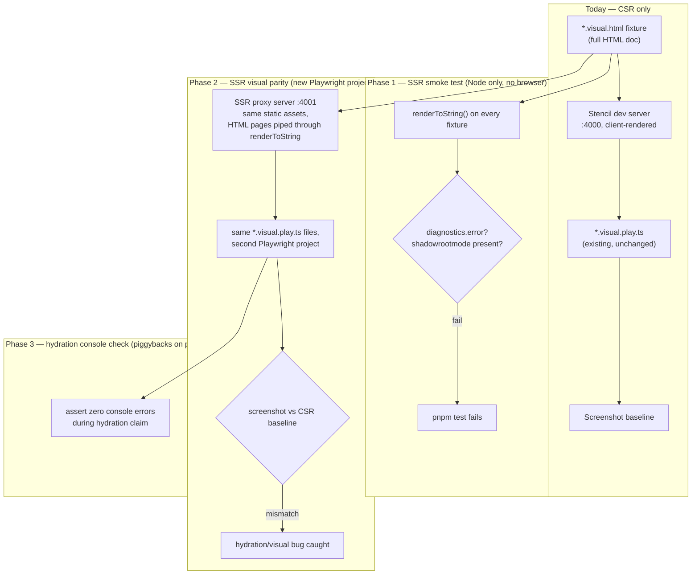

# Idea: Better SSR support via testing (draft / brainstorm)

Status: brainstorm, not yet an issue or committed plan.

## Context

`@helvetia-design/core/hydrate` (Stencil's `dist-hydrate-script` output, see
[ADR-0031](../adr/0031-ssr-hydrate-build.md)) already lets any component be
server-rendered into declarative shadow DOM. `apps/integration-ssr` proves the
primitive works end to end with a plain Node server + Playwright test.

Open question: how do we get confidence that **every** component (not just the
three used in `integration-ssr`'s hello-world fixture) actually works under SSR —
without hand-writing a bespoke SSR test per component?

## What Ionic (also Stencil-based) does, for comparison

- Publishes the same `dist-hydrate-script` output as `@ionic/core/hydrate`.
- Has a diagnostic script (`core/scripts/testing/prerender.js`) that runs every
  component's existing test fixture through `renderToString` /
  `hydrateDocument` and fails only if Stencil reports an error diagnostic. It
  then writes a side-by-side comparison HTML page for **manual** visual review.
- Not wired into CI as a hard gate (not found referenced in their GitHub
  Actions workflows).
- Real hydration bugs have still reached production despite this
  (ionic-team/ionic-framework#31466, #30490).

Takeaway: Ionic's approach only catches "did it throw", and does so with a
human in the loop, not an automated pass/fail. We can do better cheaply
because we already have per-component visual regression tests.

## Key fact that makes this cheap for us

Component fixtures like
`packages/core/src/components/actions/button/test/button.visual.html` are
already **complete, standalone `<html>` documents** — their own `<head>`,
stylesheets, `<script>` tags, everything `renderToString(html, { fullDocument:
true })` expects. No fixture rewriting needed, only a different way of
serving the same files.

## The idea, as a diagram

## Phase 1 — crash-level SSR smoke test

A small Node/Vitest script globs every `test/**/*.visual.html` +
`*.style.html` fixture (~150 files across all components), runs each through
`renderToString`, and asserts:

- no diagnostics with `level === 'error'`
- every `<ds-*>` tag present in the source produced a `shadowrootmode`
  template

Pure Node, no browser, runs in seconds. Slots into the existing `pnpm test`
job — and unlike Ionic's script, this one is CI-gated, not manual-review-only.

## Phase 2 — SSR visual parity (the actual improvement over Ionic)

Generalize the tiny server built for `apps/integration-ssr`: serve the same
static assets Stencil's dev server does (`/build/*`, `/assets/*`), but for
`.html` page requests, read the fixture and pipe it through `renderToString`
first (`serializeShadowRoot: 'declarative-shadow-dom'`).

Add one more project to `packages/core/playwright.config.mts`:

- name: `🖼️ Visual / 🧬 SSR`
- second `webServer` entry, e.g. port `4001`, pointed at the SSR proxy
- `use: { baseURL: 'http://localhost:4001' }`

**Zero new spec files.** The exact same `button.visual.play.ts` (and every
other `*.visual.play.ts`) runs unmodified against this second `baseURL`.
Playwright keeps per-project snapshot folders automatically, so this becomes a
direct pixel comparison of "SSR + hydrated" vs. "CSR" for every existing
variant of every component, for free.

**Cost tradeoff**: roughly doubles the visual suite's screenshot count and CI
time. Realistically a separate/nightly CI job rather than a per-PR gate.

## Phase 3 — hydration console-error check

Nearly free once Phase 2's proxy exists: reuse the `collectPageErrors` pattern
from `apps/integration-ssr/e2e/collect-page-errors.ts` to fail on any console
error/warning while the client claims server-rendered markup — catches DOM
mismatches that don't necessarily produce a visible pixel diff.

## Suggested order

1. Phase 1 first — cheap, fast, immediately CI-gated, closes the "does it even
   render" gap that Ionic leaves as a manual step.
2. Phase 2 only if Phase 1 turns up real interest/bugs worth chasing
   pixel-for-pixel, given the CI cost.
3. Phase 3 rides along with Phase 2's infrastructure.
