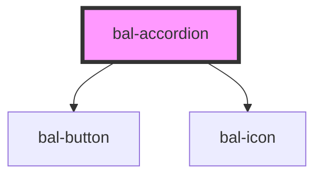

# Accordion

<!-- Auto Generated Below -->

## Properties

| Property     | Attribute     | Description                                            | Type            | Default |
| ------------ | ------------- | ------------------------------------------------------ | --------------- | ------- |
| `closeLabel` | `close-label` | Label of the close trigger button                      | `string`        | `''`    |
| `interface`  | `interface`   | Label of the open trigger button                       | `"" \| "light"` | `''`    |
| `inverted`   | `inverted`    | If `true` the component is ready for a dark background | `boolean`       | `false` |
| `isActive`   | `is-active`   | Controls if the accordion is collapsed or not          | `boolean`       | `false` |
| `openLabel`  | `open-label`  | Label of the open trigger button                       | `string`        | `''`    |

## Events

| Event         | Description                            | Type                   |
| ------------- | -------------------------------------- | ---------------------- |
| `balCollapse` | Emmited when the accordion has changed | `CustomEvent<boolean>` |

## Methods

### `close() => Promise<void>`

Close the accordion

#### Returns

Type: `Promise<void>`

### `open() => Promise<void>`

Open the accordion

#### Returns

Type: `Promise<void>`

### `toggle() => Promise<void>`

Triggers the accordion

#### Returns

Type: `Promise<void>`

## Dependencies

### Depends on

- [bal-button](../bal-button)
- [bal-icon](../bal-icon)

### Graph

----------------------------------------------

*Built with [StencilJS](https://stenciljs.com/)*
