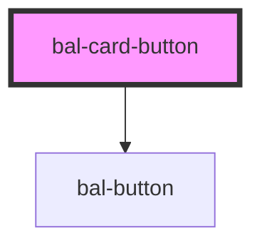

<!-- docs:child of bal-card -->

# Card Button

`bal-card-button` is a child component of `bal-card` that sets a block button at the end of the card. Good to use for edit functionality.

<!-- Auto Generated Below -->

## Properties

| Property    | Attribute    | Description                                                                         | Type                                          | Default     |
| ----------- | ------------ | ----------------------------------------------------------------------------------- | --------------------------------------------- | ----------- |
| `disabled`  | `disabled`   | If `true`, the user cannot interact with the button.                                | `boolean`                                     | `false`     |
| `href`      | `href`       | Specifies the URL of the page the link goes to                                      | `string \| undefined`                         | `undefined` |
| `icon`      | `icon`       | Name of the icon like `edit`.                                                       | `string`                                      | `''`        |
| `iconRight` | `icon-right` | Name of the right button icon                                                       | `string`                                      | `''`        |
| `loading`   | `loading`    | If `true` the label is hidden and a loading spinner is shown instead.               | `boolean`                                     | `false`     |
| `target`    | `target`     | Specifies where to display the linked URL. Only applies when an `href` is provided. | `" _parent" \| "_blank" \| "_self" \| "_top"` | `'_self'`   |
| `type`      | `type`       | The type of button.                                                                 | `"button" \| "reset" \| "submit"`             | `'button'`  |

## Dependencies

### Depends on

- [bal-button](../bal-button)

### Graph

----------------------------------------------

*Built with [StencilJS](https://stenciljs.com/)*
