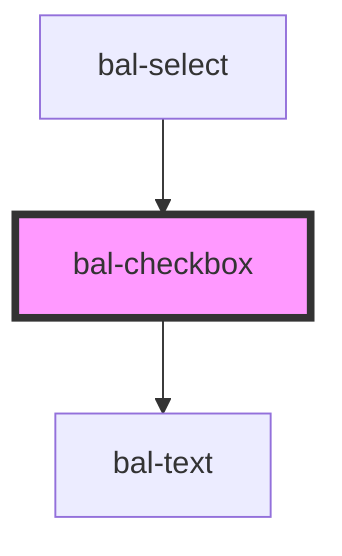

# bal-checkbox <Badge text="Two-way binding"/>

<!-- Auto Generated Below -->

## Properties

| Property      | Attribute      | Description                                                     | Type                     | Default        |
| ------------- | -------------- | --------------------------------------------------------------- | ------------------------ | -------------- |
| `balTabindex` | `bal-tabindex` | The tabindex of the control.                                    | `number`                 | `0`            |
| `checked`     | `checked`      | If `true`, the checkbox is selected.                            | `boolean`                | `false`        |
| `disabled`    | `disabled`     | If `true`, the user cannot interact with the checkbox.          | `boolean`                | `false`        |
| `interface`   | `interface`    | Defines the layout of the checkbox button                       | `"checkbox" \| "switch"` | `'checkbox'`   |
| `inverted`    | `inverted`     | If `true`, the control works on dark background.                | `boolean`                | `false`        |
| `name`        | `name`         | The name of the control, which is submitted with the form data. | `string`                 | `this.inputId` |
| `value`       | `value`        | The value of the control.                                       | `string`                 | `'on'`         |

## Events

| Event       | Description                                    | Type                      |
| ----------- | ---------------------------------------------- | ------------------------- |
| `balBlur`   | Emitted when the toggle loses focus.           | `CustomEvent<FocusEvent>` |
| `balChange` | Emitted when the checked property has changed. | `CustomEvent<boolean>`    |
| `balFocus`  | Emitted when the toggle has focus.             | `CustomEvent<FocusEvent>` |

## Methods

### `getInputElement() => Promise<HTMLInputElement>`

Returns the native `<input>` element used under the hood.

#### Returns

Type: `Promise<HTMLInputElement>`

### `setFocus() => Promise<void>`

Sets the focus on the checkbox input element.

#### Returns

Type: `Promise<void>`

## Dependencies

### Used by

 - [bal-select](../bal-select)

### Depends on

- [bal-text](../bal-text)

### Graph

----------------------------------------------

*Built with [StencilJS](https://stenciljs.com/)*
