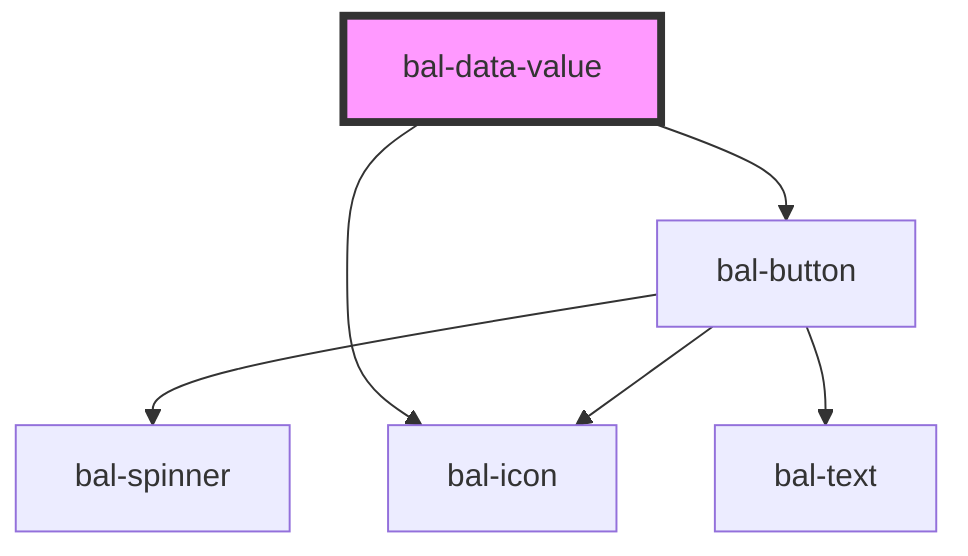

<!-- docs:child of bal-data -->

# bal-data-item-value

`bal-data-item` is a child component of `bal-data` that defines the value of the data.

<!-- Auto Generated Below -->

## Properties

| Property   | Attribute  | Description                                                           | Type      | Default |
| ---------- | ---------- | --------------------------------------------------------------------- | --------- | ------- |
| `disabled` | `disabled` | If `true` the button will get disabled.                               | `boolean` | `false` |
| `editable` | `editable` | If `true` a small button with a edit icon will be shown on the right. | `boolean` | `false` |

## Events

| Event      | Description                               | Type                      |
| ---------- | ----------------------------------------- | ------------------------- |
| `balBlur`  | Emitted when the edit button loses focus. | `CustomEvent<void>`       |
| `balClick` | Emitted when the edit button has focus.   | `CustomEvent<MouseEvent>` |
| `balFocus` | Emitted when the edit button has focus.   | `CustomEvent<void>`       |

## Dependencies

### Depends on

- [bal-button](../bal-button)
- [bal-icon](../bal-icon)

### Graph

----------------------------------------------

*Built with [StencilJS](https://stenciljs.com/)*
