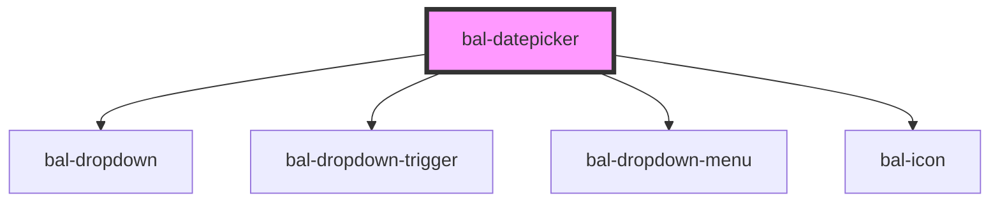

# Datepicker <Badge text="Two-way binding"/>

To set the date use the [date utils](/components/tooling/utils.html#dateutil).

```javascript
import { newDateString, now } from '@baloise/design-system-components'

const datepickerDisabled = document.getElementById('datepicker-disabled')
datepickerDisabled.value = newDateString(now())
// or
datepickerDisabled.value = newDateString(2020, 0, 13)
// or
datepickerDisabled.value = newDateString(new Date(2020, 0, 13))
```

<!-- Auto Generated Below -->


## Properties

| Property        | Attribute         | Description                                                                                                                                                                                                                                                                                                                                                             | Type                                             | Default        |
| --------------- | ----------------- | ----------------------------------------------------------------------------------------------------------------------------------------------------------------------------------------------------------------------------------------------------------------------------------------------------------------------------------------------------------------------- | ------------------------------------------------ | -------------- |
| `allowedDates`  | --                | Callback to determine which date in the datepicker should be selectable.                                                                                                                                                                                                                                                                                                | `((datestring: string) => boolean) \| undefined` | `undefined`    |
| `balTabindex`   | `bal-tabindex`    | The tabindex of the control.                                                                                                                                                                                                                                                                                                                                            | `number`                                         | `0`            |
| `closeOnSelect` | `close-on-select` | Closes the datepicker dropdown after selection                                                                                                                                                                                                                                                                                                                          | `boolean`                                        | `true`         |
| `debounce`      | `debounce`        | Set the amount of time, in milliseconds, to wait to trigger the `ionChange` event after each keystroke. This also impacts form bindings such as `ngModel` or `v-model`.                                                                                                                                                                                                 | `number`                                         | `0`            |
| `defaultDate`   | `default-date`    | The date to defines where the datepicker popup starts. The prop accepts ISO 8601 date strings (YYYY-MM-DD).                                                                                                                                                                                                                                                             | `null \| string \| undefined`                    | `undefined`    |
| `disabled`      | `disabled`        | If `true` the component is diabled.                                                                                                                                                                                                                                                                                                                                     | `boolean`                                        | `false`        |
| `expanded`      | `expanded`        | If `true` the component uses the whole width.                                                                                                                                                                                                                                                                                                                           | `boolean`                                        | `false`        |
| `inverted`      | `inverted`        | Set this to `true` when the component is placed on a dark background.                                                                                                                                                                                                                                                                                                   | `boolean`                                        | `false`        |
| `locale`        | `locale`          | If `true` the component uses the whole width.                                                                                                                                                                                                                                                                                                                           | `"de" \| "en" \| "fr" \| "it"`                   | `'en'`         |
| `max`           | `max`             | The maximum datetime allowed. Value must be a date string following the [ISO 8601 datetime format standard](https://www.w3.org/TR/NOTE-datetime), `1996-12-19`. The format does not have to be specific to an exact datetime. For example, the maximum could just be the year, such as `1994`. Defaults to the end of this year.                                        | `string \| undefined`                            | `undefined`    |
| `maxYearProp`   | `max-year`        | Latest year available for selection                                                                                                                                                                                                                                                                                                                                     | `number \| undefined`                            | `undefined`    |
| `min`           | `min`             | The minimum datetime allowed. Value must be a date string following the [ISO 8601 datetime format standard](https://www.w3.org/TR/NOTE-datetime), such as `1996-12-19`. The format does not have to be specific to an exact datetime. For example, the minimum could just be the year, such as `1994`. Defaults to the beginning of the year, 100 years ago from today. | `string \| undefined`                            | `undefined`    |
| `minYearProp`   | `min-year`        | Earliest year available for selection                                                                                                                                                                                                                                                                                                                                   | `number \| undefined`                            | `undefined`    |
| `name`          | `name`            | The name of the control, which is submitted with the form data.                                                                                                                                                                                                                                                                                                         | `string`                                         | `this.inputId` |
| `placeholder`   | `placeholder`     | The text to display when the select is empty.                                                                                                                                                                                                                                                                                                                           | `string \| undefined`                            | `undefined`    |
| `readonly`      | `readonly`        | If `true` the use can only select a date.                                                                                                                                                                                                                                                                                                                               | `boolean`                                        | `false`        |
| `required`      | `required`        | If `true` the attribute required is added to the native input.                                                                                                                                                                                                                                                                                                          | `boolean`                                        | `false`        |
| `triggerIcon`   | `trigger-icon`    | If `true` the datepicker only open on click of the icon                                                                                                                                                                                                                                                                                                                 | `boolean`                                        | `false`        |
| `value`         | `value`           | The value of the form field, which accepts ISO 8601 date strings (YYYY-MM-DD).                                                                                                                                                                                                                                                                                          | `null \| string \| undefined`                    | `undefined`    |


## Events

| Event       | Description                             | Type                                       |
| ----------- | --------------------------------------- | ------------------------------------------ |
| `balBlur`   | Emitted when the input loses focus.     | `CustomEvent<FocusEvent>`                  |
| `balChange` | Emitted when a option got selected.     | `CustomEvent<null \| string \| undefined>` |
| `balFocus`  | Emitted when the input has focus.       | `CustomEvent<FocusEvent>`                  |
| `balInput`  | Emitted when a keyboard input occurred. | `CustomEvent<string>`                      |


## Methods

### `close() => Promise<void>`

Closes the dropdown

#### Returns

Type: `Promise<void>`


### `getInputElement() => Promise<HTMLInputElement>`

Returns the native `<input>` element used under the hood.

#### Returns

Type: `Promise<HTMLInputElement>`


### `open() => Promise<void>`

Opens the dropdown

#### Returns

Type: `Promise<void>`


### `select(datestring: string) => Promise<void>`

Selects an option

#### Returns

Type: `Promise<void>`


### `setFocus() => Promise<void>`

Sets the focus on the input element

#### Returns

Type: `Promise<void>`


## Dependencies

### Depends on

- [bal-dropdown](../bal-dropdown)
- [bal-dropdown-trigger](../bal-dropdown-trigger)
- [bal-dropdown-menu](../bal-dropdown-menu)
- [bal-icon](../bal-icon)

### Graph


----------------------------------------------

*Built with [StencilJS](https://stenciljs.com/)*
