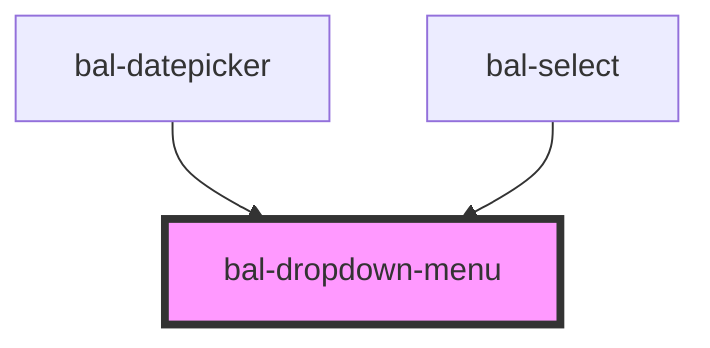

<!-- docs:child of bal-dropdown -->

# Dropdown Menu

`bal-dropdown-menu` is a child component of `bal-dropdown` that defines the value of the data.

<!-- Auto Generated Below -->

## Properties

| Property     | Attribute    | Description                                                         | Type     | Default |
| ------------ | ------------ | ------------------------------------------------------------------- | -------- | ------- |
| `scrollable` | `scrollable` | Limit the height of the dropdown content. Pass the amount of pixel. | `number` | `0`     |

## Dependencies

### Used by

 - [bal-datepicker](../bal-datepicker)
 - [bal-select](../bal-select)

### Graph

----------------------------------------------

*Built with [StencilJS](https://stenciljs.com/)*
