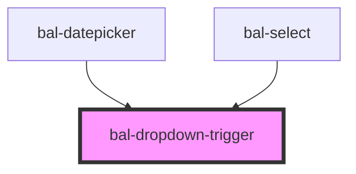

<!-- docs:child of bal-dropdown -->

# bal-dropdown-trigger

`bal-dropdown-trigger` is a child component of `bal-dropdown` that defines the value of the data.

<!-- Auto Generated Below -->

## Dependencies

### Used by

 - [bal-datepicker](../bal-datepicker)
 - [bal-select](../bal-select)

### Graph

----------------------------------------------

*Built with [StencilJS](https://stenciljs.com/)*
