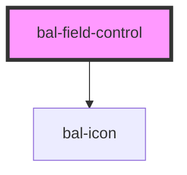

<!-- docs:child of bal-field -->

# Field Control

`bal-field-control` is a child component of `bal-field`.

<!-- Auto Generated Below -->

## Dependencies

### Depends on

- [bal-icon](../bal-icon)

### Graph

----------------------------------------------

*Built with [StencilJS](https://stenciljs.com/)*
