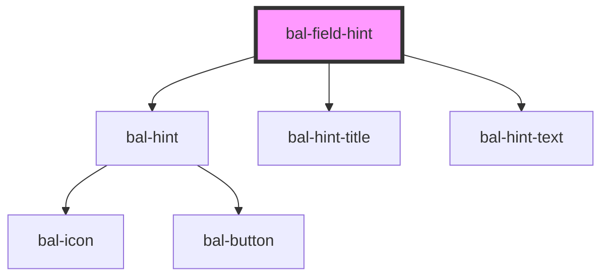

<!-- docs:child of bal-field -->

# Field Hint

`bal-field-hint` is a child component of `bal-field`.

<!-- Auto Generated Below -->

## Properties

| Property  | Attribute | Description              | Type     | Default |
| --------- | --------- | ------------------------ | -------- | ------- |
| `subject` | `subject` | Text of the inputs label | `string` | `''`    |

## Dependencies

### Depends on

- [bal-hint](../bal-hint)
- [bal-hint-title](../bal-hint-title)
- [bal-hint-text](../bal-hint-text)

### Graph

----------------------------------------------

*Built with [StencilJS](https://stenciljs.com/)*
