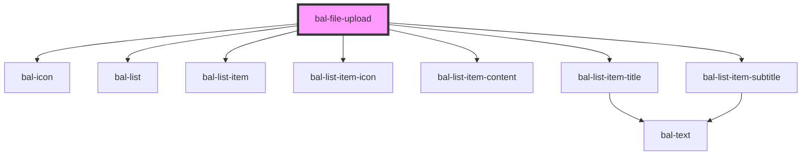

# File Upload

<!-- Auto Generated Below -->

## Properties

| Property        | Attribute         | Description                                      | Type                                    | Default                      |
| --------------- | ----------------- | ------------------------------------------------ | --------------------------------------- | ---------------------------- |
| `accept`        | `accept`          | Accepted MIME-Types like `image/png,image/jpeg`. | `string`                                | `''`                         |
| `disabled`      | `disabled`        | If `true` the button is disabled                 | `boolean`                               | `false`                      |
| `label`         | `label`           | Label of the drop area.                          | `string`                                | `'Choose or drop a file...'` |
| `maxBundleSize` | `max-bundle-size` | Allowed max bundle size in bytes.                | `number \| undefined`                   | `undefined`                  |
| `maxFileSize`   | `max-file-size`   | Allowed max file size in bytes.                  | `number \| undefined`                   | `undefined`                  |
| `maxFiles`      | `max-files`       | Allowed number of files in the bundle.           | `number \| undefined`                   | `undefined`                  |
| `multiple`      | `multiple`        | If `true` multiple file upload is possible.      | `boolean`                               | `true`                       |
| `subTitle`      | --                | Overrides the default subtitle filesize          | `((file: File) => string) \| undefined` | `undefined`                  |
| `value`         | --                | Input value.                                     | `File[]`                                | `[]`                         |

## Events

| Event             | Description                                                              | Type                                  |
| ----------------- | ------------------------------------------------------------------------ | ------------------------------------- |
| `balChange`       | Triggers when a file is added or removed.                                | `CustomEvent<File[]>`                 |
| `balRejectedFile` | Triggers when a file is rejected due to not allowed MIME-Type and so on. | `CustomEvent<FileUploadRejectedFile>` |

## Methods

### `clear() => Promise<void>`

Sets the file list to an empty list

#### Returns

Type: `Promise<void>`

## Dependencies

### Depends on

- [bal-icon](../bal-icon)
- [bal-list](../bal-list)
- [bal-list-item](../bal-list-item)
- [bal-list-item-icon](../bal-list-item-icon)
- [bal-list-item-content](../bal-list-item-content)
- [bal-list-item-title](../bal-list-item-title)
- [bal-list-item-subtitle](../bal-list-item-subtitle)

### Graph

----------------------------------------------

*Built with [StencilJS](https://stenciljs.com/)*
