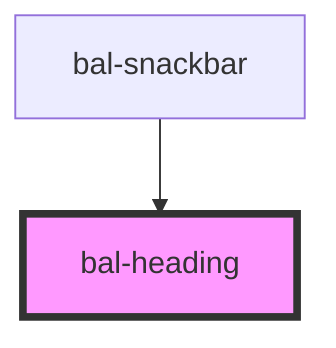

# bal-heading

<!-- Auto Generated Below -->

## Properties

| Property      | Attribute      | Description                                                                                                                                             | Type                                                              | Default     |
| ------------- | -------------- | ------------------------------------------------------------------------------------------------------------------------------------------------------- | ----------------------------------------------------------------- | ----------- |
| `color`       | `color`        | The theme type of the toast. Given by bulma our css framework.                                                                                          | `"" \| "danger" \| "info" \| "primary" \| "success" \| "warning"` | `''`        |
| `inverted`    | `inverted`     | If `true` the button is inverted                                                                                                                        | `boolean`                                                         | `false`     |
| `level`       | `level`        | The actual heading level used in the HTML markup.                                                                                                       | `"h1" \| "h2" \| "h3" \| "h4" \| "h5" \| "h6"`                    | `'h1'`      |
| `spaced`      | `spaced`       | If 'false' the margin of the heading gets dropped.                                                                                                      | `boolean`                                                         | `true`      |
| `subtitle`    | `subtitle`     | If `true` the heading gets displayed slimmer.                                                                                                           | `boolean`                                                         | `false`     |
| `visualLevel` | `visual-level` | Make the visual style mimic a specific heading level. This option allows you to make e.g. h1 visually look like h3, but still keep it h1 in the markup. | `"h1" \| "h2" \| "h3" \| "h4" \| "h5" \| "h6" \| undefined`       | `undefined` |

## Dependencies

### Used by

 - [bal-snackbar](../bal-snackbar)

### Graph

----------------------------------------------

*Built with [StencilJS](https://stenciljs.com/)*
