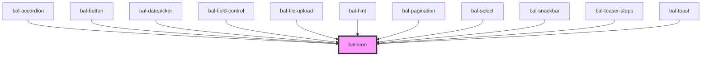

# bal-icon

## Icons

<!-- Auto Generated Icons -->

| Icon | Name |
| ---- | ---- |
| <bal-icon name="account" /> | `account` |
| <bal-icon name="alert-circle" /> | `alert-circle` |
| <bal-icon name="alert" /> | `alert` |
| <bal-icon name="answer" /> | `answer` |
| <bal-icon name="call" /> | `call` |
| <bal-icon name="caret-down" /> | `caret-down` |
| <bal-icon name="caret-left" /> | `caret-left` |
| <bal-icon name="caret-right" /> | `caret-right` |
| <bal-icon name="caret-up" /> | `caret-up` |
| <bal-icon name="check-circle" /> | `check-circle` |
| <bal-icon name="check" /> | `check` |
| <bal-icon name="clock" /> | `clock` |
| <bal-icon name="close" /> | `close` |
| <bal-icon name="consultant" /> | `consultant` |
| <bal-icon name="contact" /> | `contact` |
| <bal-icon name="copy" /> | `copy` |
| <bal-icon name="date" /> | `date` |
| <bal-icon name="document" /> | `document` |
| <bal-icon name="download" /> | `download` |
| <bal-icon name="edit" /> | `edit` |
| <bal-icon name="eye-closed" /> | `eye-closed` |
| <bal-icon name="github" /> | `github` |
| <bal-icon name="info-circle" /> | `info-circle` |
| <bal-icon name="info" /> | `info` |
| <bal-icon name="locate" /> | `locate` |
| <bal-icon name="location" /> | `location` |
| <bal-icon name="logo" /> | `logo` |
| <bal-icon name="menu-bars" /> | `menu-bars` |
| <bal-icon name="menu-dots" /> | `menu-dots` |
| <bal-icon name="message" /> | `message` |
| <bal-icon name="minus" /> | `minus` |
| <bal-icon name="nav-back" /> | `nav-back` |
| <bal-icon name="nav-go-down" /> | `nav-go-down` |
| <bal-icon name="nav-go-left" /> | `nav-go-left` |
| <bal-icon name="nav-go-right" /> | `nav-go-right` |
| <bal-icon name="nav-go-up" /> | `nav-go-up` |
| <bal-icon name="plus" /> | `plus` |
| <bal-icon name="print" /> | `print` |
| <bal-icon name="read-only" /> | `read-only` |
| <bal-icon name="refresh" /> | `refresh` |
| <bal-icon name="search" /> | `search` |
| <bal-icon name="send" /> | `send` |
| <bal-icon name="social-facebook-line" /> | `social-facebook-line` |
| <bal-icon name="social-linkedin-line" /> | `social-linkedin-line` |
| <bal-icon name="social-xing-line" /> | `social-xing-line` |
| <bal-icon name="trash" /> | `trash` |
| <bal-icon name="upload" /> | `upload` |
<!-- Auto Generated Below -->

## Properties

| Property   | Attribute  | Description                                                     | Type                                                                                                     | Default  |
| ---------- | ---------- | --------------------------------------------------------------- | -------------------------------------------------------------------------------------------------------- | -------- |
| `color`    | `color`    | The theme type of the button. Given by bulma our css framework. | `"danger" \| "info" \| "info-light" \| "link" \| "primary" \| "primary-light" \| "success" \| "warning"` | `'info'` |
| `inverted` | `inverted` | If `true` the button is inverted                                | `boolean`                                                                                                | `false`  |
| `name`     | `name`     | The name of the icon without the bal-icon prefix.               | `string`                                                                                                 | `''`     |
| `rotate`   | `rotate`   | If `true` the icon rotates like for a loading spinner           | `boolean`                                                                                                | `false`  |
| `size`     | `size`     | Defines the size of the icon.                                   | `"" \| "large" \| "medium" \| "small" \| "xsmall"`                                                       | `''`     |
| `turn`     | `turn`     | If `true` the icon is rotated 180deg                            | `boolean`                                                                                                | `false`  |

## Dependencies

### Used by

 - [bal-accordion](../bal-accordion)
 - [bal-button](../bal-button)
 - [bal-datepicker](../bal-datepicker)
 - [bal-field-control](../bal-field-control)
 - [bal-file-upload](../bal-file-upload)
 - [bal-hint](../bal-hint)
 - [bal-pagination](../bal-pagination)
 - [bal-select](../bal-select)
 - [bal-snackbar](../bal-snackbar)
 - [bal-teaser-steps](../bal-teaser-steps)
 - [bal-toast](../bal-toast)

### Graph

----------------------------------------------

*Built with [StencilJS](https://stenciljs.com/)*
