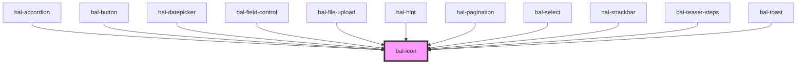

# bal-icon

<!-- Auto Generated Below -->

## Properties

| Property   | Attribute  | Description                                                     | Type                                                                                                     | Default  |
| ---------- | ---------- | --------------------------------------------------------------- | -------------------------------------------------------------------------------------------------------- | -------- |
| `color`    | `color`    | The theme type of the button. Given by bulma our css framework. | `"danger" \| "info" \| "info-light" \| "link" \| "primary" \| "primary-light" \| "success" \| "warning"` | `'info'` |
| `inverted` | `inverted` | If `true` the button is inverted                                | `boolean`                                                                                                | `false`  |
| `name`     | `name`     | Name of the baloise icon.                                       | `string`                                                                                                 | `''`     |
| `rotate`   | `rotate`   | If `true` the icon rotates like for a loading spinner           | `boolean`                                                                                                | `false`  |
| `size`     | `size`     | Defines the size of the icon.                                   | `"" \| "large" \| "medium" \| "small" \| "xsmall"`                                                       | `''`     |
| `svg`      | `svg`      | Svg content.                                                    | `string`                                                                                                 | `''`     |
| `turn`     | `turn`     | If `true` the icon is rotated 180deg                            | `boolean`                                                                                                | `false`  |

## Dependencies

### Used by

 - [bal-accordion](../bal-accordion)
 - [bal-button](../bal-button)
 - [bal-datepicker](../bal-datepicker)
 - [bal-field-control](../bal-field-control)
 - [bal-file-upload](../bal-file-upload)
 - [bal-hint](../bal-hint)
 - [bal-pagination](../bal-pagination)
 - [bal-select](../bal-select)
 - [bal-snackbar](../bal-snackbar)
 - [bal-teaser-steps](../bal-teaser-steps)
 - [bal-toast](../bal-toast)

### Graph

----------------------------------------------

*Built with [StencilJS](https://stenciljs.com/)*
