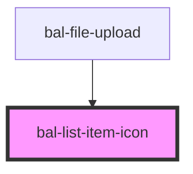

<!-- docs:child of bal-list -->

# List Item Icon

`bal-list-item-subtitle` is a child component of `bal-list` that defines the subtitle list row element.

<!-- Auto Generated Below -->

## Properties

| Property | Attribute | Description | Type      | Default |
| -------- | --------- | ----------- | --------- | ------- |
| `dense`  | `dense`   |             | `boolean` | `false` |

## Dependencies

### Used by

 - [bal-file-upload](../bal-file-upload)

### Graph

----------------------------------------------

*Built with [StencilJS](https://stenciljs.com/)*
