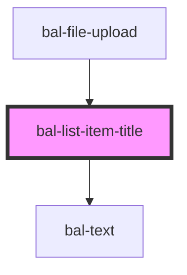

<!-- docs:child of bal-list -->

# List Item Title

`bal-list-item-title` is a child component of `bal-list` that defines the title list row element.

<!-- Auto Generated Below -->

## Dependencies

### Used by

 - [bal-file-upload](../bal-file-upload)

### Depends on

- [bal-text](../bal-text)

### Graph

----------------------------------------------

*Built with [StencilJS](https://stenciljs.com/)*
