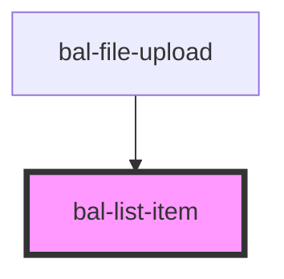

<!-- docs:child of bal-list -->

# bal-list-item

<!-- Auto Generated Below -->

## Properties

| Property    | Attribute   | Description                                        | Type                                          | Default   |
| ----------- | ----------- | -------------------------------------------------- | --------------------------------------------- | --------- |
| `clickable` | `clickable` | If `true` the list item shows that it is clickable | `boolean`                                     | `false`   |
| `disabled`  | `disabled`  | If `true` the list item can be hovered             | `boolean`                                     | `false`   |
| `href`      | `href`      | Specifies the URL of the page the link goes to     | `string`                                      | `''`      |
| `selected`  | `selected`  | If `true` the list item has a selected theme       | `boolean`                                     | `false`   |
| `target`    | `target`    | Specifies where to open the linked document        | `" _parent" \| "_blank" \| "_self" \| "_top"` | `'_self'` |

## Events

| Event         | Description                               | Type                      |
| ------------- | ----------------------------------------- | ------------------------- |
| `balNavigate` | Emitted when the link element has clicked | `CustomEvent<MouseEvent>` |

## Dependencies

### Used by

 - [bal-file-upload](../bal-file-upload)

### Graph

----------------------------------------------

*Built with [StencilJS](https://stenciljs.com/)*
