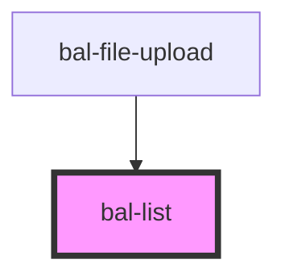

# List

<!-- Auto Generated Below -->

## Properties

| Property   | Attribute  | Description                                        | Type      | Default |
| ---------- | ---------- | -------------------------------------------------- | --------- | ------- |
| `inverted` | `inverted` | If `true` the list can be used on a dark backround | `boolean` | `false` |

## Dependencies

### Used by

 - [bal-file-upload](../bal-file-upload)

### Graph

----------------------------------------------

*Built with [StencilJS](https://stenciljs.com/)*
