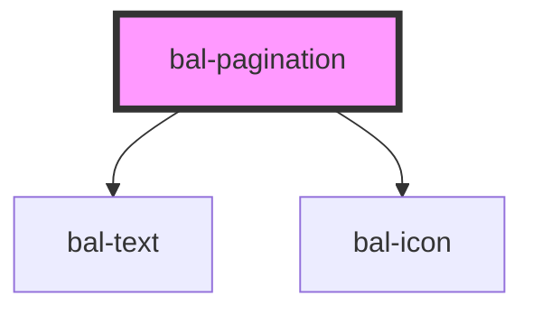

# bal-pagination

<!-- Auto Generated Below -->

## Properties

| Property     | Attribute     | Description                                                      | Type      | Default |
| ------------ | ------------- | ---------------------------------------------------------------- | --------- | ------- |
| `disabled`   | `disabled`    | Disables component                                               | `boolean` | `false` |
| `pageRange`  | `page-range`  | Specify the max visible pages before and after the selected page | `number`  | `2`     |
| `totalPages` | `total-pages` | The total amount of pages                                        | `number`  | `1`     |
| `value`      | `value`       | Current selected page                                            | `number`  | `1`     |

## Events

| Event       | Description                         | Type                  |
| ----------- | ----------------------------------- | --------------------- |
| `balChange` | Triggers when a page change happens | `CustomEvent<number>` |

## Methods

### `next() => Promise<void>`

Go to the next page

#### Returns

Type: `Promise<void>`

### `previous() => Promise<void>`

Go to the prvious page

#### Returns

Type: `Promise<void>`

## Dependencies

### Depends on

- [bal-text](../bal-text)
- [bal-icon](../bal-icon)

### Graph

----------------------------------------------

*Built with [StencilJS](https://stenciljs.com/)*
