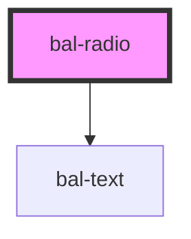

# Radio <Badge text="Two-way binding"/>

<!-- Auto Generated Below -->

## Properties

| Property      | Attribute      | Description                                                     | Type                         | Default        |
| ------------- | -------------- | --------------------------------------------------------------- | ---------------------------- | -------------- |
| `balTabindex` | `bal-tabindex` | The tabindex of the control.                                    | `number`                     | `0`            |
| `checked`     | `checked`      | If `true`, the radio is selected.                               | `boolean`                    | `false`        |
| `disabled`    | `disabled`     | If `true`, the user cannot interact with the checkbox.          | `boolean`                    | `false`        |
| `interface`   | `interface`    | Defines the layout of the radio button                          | `"radio" \| "select-button"` | `'radio'`      |
| `inverted`    | `inverted`     | If `true`, the control works on dark background.                | `boolean`                    | `false`        |
| `isEmpty`     | `is-empty`     | If `true` the radio has no label                                | `boolean`                    | `false`        |
| `name`        | `name`         | The name of the control, which is submitted with the form data. | `string`                     | `this.inputId` |
| `value`       | `value`        | The value of the control.                                       | `string`                     | `''`           |

## Events

| Event      | Description                          | Type                      |
| ---------- | ------------------------------------ | ------------------------- |
| `balBlur`  | Emitted when the toggle loses focus. | `CustomEvent<FocusEvent>` |
| `balFocus` | Emitted when the toggle has focus.   | `CustomEvent<FocusEvent>` |

## Methods

### `setFocus() => Promise<void>`

Sets the focus on the input element.

#### Returns

Type: `Promise<void>`

## Dependencies

### Depends on

- [bal-text](../bal-text)

### Graph

----------------------------------------------

*Built with [StencilJS](https://stenciljs.com/)*
