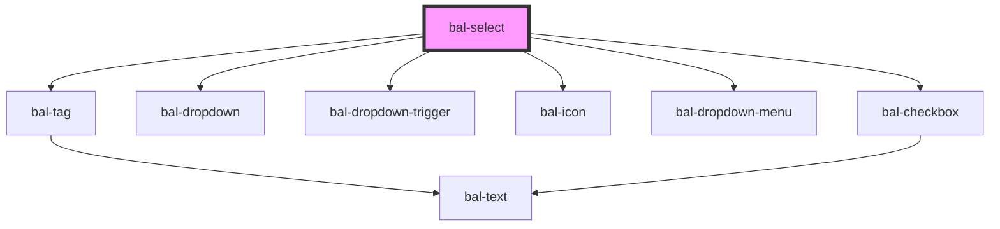

# bal-select <Badge text="Two-way binding"/>

For creating a list of options use the `BalOptionValue` interface.

```typescript
export interface BalOptionValue<T> {
  value: string
  label: string
  disabled?: boolean
  data?: T
}
```

<!-- Auto Generated Below -->


## Properties

| Property      | Attribute       | Description                                                                       | Type                                          | Default        |
| ------------- | --------------- | --------------------------------------------------------------------------------- | --------------------------------------------- | -------------- |
| `balTabindex` | `bal-tabindex`  | The tabindex of the control.                                                      | `number`                                      | `0`            |
| `disabled`    | `disabled`      | If `true` the component is diabled.                                               | `boolean`                                     | `false`        |
| `expanded`    | `expanded`      | If `true` the component uses the whole width.                                     | `boolean`                                     | `false`        |
| `hasMovement` | `has-movement`  | Enables the slide in animation for the option items.                              | `boolean`                                     | `false`        |
| `inverted`    | `inverted`      | Set this to `true` when the component is placed on a dark background.             | `boolean`                                     | `false`        |
| `loading`     | `loading`       |                                                                                   | `boolean`                                     | `false`        |
| `multiple`    | `multiple`      | If `true` multiple option can be selected                                         | `boolean`                                     | `false`        |
| `name`        | `name`          | The name of the control, which is submitted with the form data.                   | `string`                                      | `this.inputId` |
| `noBorder`    | `no-border`     | Removes the border of the input.                                                  | `boolean`                                     | `false`        |
| `noDataLabel` | `no-data-label` | This label is shown if typeahead is active and all the options are filtered out.  | `string \| undefined`                         | `undefined`    |
| `placeholder` | `placeholder`   | The text to display when the select is empty.                                     | `string \| undefined`                         | `undefined`    |
| `scrollable`  | `scrollable`    | Defines the height of the dropdown list.                                          | `number`                                      | `250`          |
| `searchInput` | --              |                                                                                   | `((inputValue: string) => void) \| undefined` | `undefined`    |
| `typeahead`   | `typeahead`     | If `true` the user can search by typing into the input field.                     | `boolean`                                     | `false`        |
| `value`       | --              | Selected option values. Could also be passed as a string, which gets transformed. | `string[] \| undefined`                       | `[]`           |


## Events

| Event         | Description                                                        | Type                         |
| ------------- | ------------------------------------------------------------------ | ---------------------------- |
| `balBlur`     | Emitted when the input loses focus.                                | `CustomEvent<FocusEvent>`    |
| `balCancel`   | Emitted when the user cancels the input.                           | `CustomEvent<KeyboardEvent>` |
| `balChange`   | Emitted when a option got selected.                                | `CustomEvent<string[]>`      |
| `balClick`    | Emitted when the input got clicked.                                | `CustomEvent<MouseEvent>`    |
| `balFocus`    | Emitted when the input has focus.                                  | `CustomEvent<FocusEvent>`    |
| `balInput`    | Emitted when a keyboard input occurred.                            | `CustomEvent<string>`        |
| `balKeyPress` | Emitted when the input has focus and key from the keyboard go hit. | `CustomEvent<KeyboardEvent>` |


## Methods

### `cancel() => Promise<void>`

Cancel the dropdown

#### Returns

Type: `Promise<void>`


### `clear() => Promise<void>`

Sets the value to `[]`, the input value to ´''´ and the focus index to ´0´.

#### Returns

Type: `Promise<void>`


### `close() => Promise<void>`

Closes the dropdown

#### Returns

Type: `Promise<void>`


### `open() => Promise<void>`

Opens the dropdown

#### Returns

Type: `Promise<void>`


### `select(value: string) => Promise<void>`

Select option by passed value

#### Returns

Type: `Promise<void>`


### `setFocus() => Promise<void>`

Sets the focus on the input element

#### Returns

Type: `Promise<void>`


## Dependencies

### Depends on

- [bal-tag](../bal-tag)
- [bal-dropdown](../bal-dropdown)
- [bal-dropdown-trigger](../bal-dropdown-trigger)
- [bal-icon](../bal-icon)
- [bal-dropdown-menu](../bal-dropdown-menu)
- [bal-checkbox](../bal-checkbox)

### Graph


----------------------------------------------

*Built with [StencilJS](https://stenciljs.com/)*
