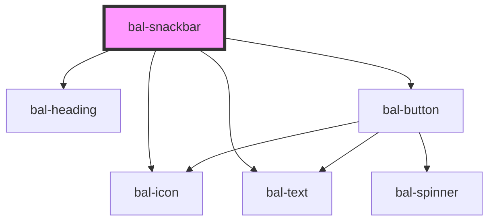

# bal-snackbar

## Usage

Toast can be created with the `balScnackbarController`. The default duration is 5000 milliseconds.

```typescript
import { balScnackbarController } from '@baloise/design-system-components'

balScnackbarController.create({ message: 'Hi I am a default Toast!', duration: 1000 })
```

<!-- Auto Generated Below -->


## Properties

| Property   | Attribute  | Description                                                       | Type                                                              | Default |
| ---------- | ---------- | ----------------------------------------------------------------- | ----------------------------------------------------------------- | ------- |
| `action`   | `action`   | Label text for the action button                                  | `string`                                                          | `''`    |
| `color`    | `color`    | The theme type of the snackbar. Given by bulma our css framework. | `"" \| "danger" \| "info" \| "primary" \| "success" \| "warning"` | `''`    |
| `duration` | `duration` | The duration of the snackbar                                      | `number`                                                          | `0`     |
| `icon`     | `icon`     | The icon of the snackbar header                                   | `string`                                                          | `''`    |
| `message`  | `message`  | The message of the snackbar                                       | `string`                                                          | `''`    |
| `subject`  | `subject`  | The subject of the snackbar header                                | `string`                                                          | `''`    |


## Events

| Event       | Description                               | Type                  |
| ----------- | ----------------------------------------- | --------------------- |
| `balAction` | Emitted when the action button is clicked | `CustomEvent<string>` |
| `balClose`  | Emitted when snackbar is closed           | `CustomEvent<string>` |


## Methods

### `close() => Promise<void>`

Closes this snackbar

#### Returns

Type: `Promise<void>`


### `closeIn(duration: number) => Promise<void>`

Closes the snackbar after the given duration in ms

#### Returns

Type: `Promise<void>`


## Dependencies

### Depends on

- [bal-icon](../bal-icon)
- [bal-heading](../bal-heading)
- [bal-text](../bal-text)
- [bal-button](../bal-button)

### Graph


----------------------------------------------

*Built with [StencilJS](https://stenciljs.com/)*
