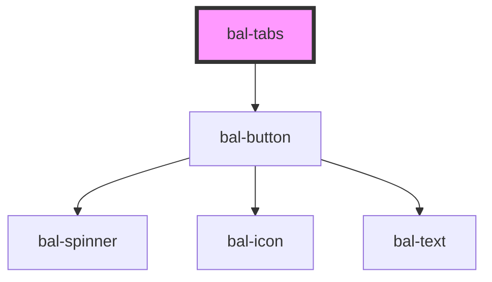

# bal-tabs

Tabs are used to structure the information in sub section on the same page.

<!-- Auto Generated Below -->

## Properties

| Property      | Attribute      | Description                                       | Type                | Default  |
| ------------- | -------------- | ------------------------------------------------- | ------------------- | -------- |
| `action`      | `action`       | If `true` a acation button is added to the right  | `boolean`           | `false`  |
| `actionLabel` | `action-label` | Label for the action button                       | `string`            | `''`     |
| `expanded`    | `expanded`     | If `true` the field expands over the whole width. | `boolean`           | `false`  |
| `interface`   | `interface`    | Defines the layout of the tabs.                   | `"steps" \| "tabs"` | `'tabs'` |
| `rounded`     | `rounded`      | If you want the rounded tab style.                | `boolean`           | `false`  |

## Events

| Event            | Description                                | Type                        |
| ---------------- | ------------------------------------------ | --------------------------- |
| `balActionClick` | Emitted when the action button has clicked | `CustomEvent<MouseEvent>`   |
| `balTabChange`   | Emitted when the changes has finished.     | `CustomEvent<BalTabOption>` |

## Methods

### `select(tab: BalTabOption) => Promise<void>`

Go to tab with the given value

#### Returns

Type: `Promise<void>`

### `sync() => Promise<void>`

*Internal* - Rerenders the tabs with their given settings

#### Returns

Type: `Promise<void>`

## Dependencies

### Depends on

- [bal-button](../bal-button)

### Graph

----------------------------------------------

*Built with [StencilJS](https://stenciljs.com/)*
