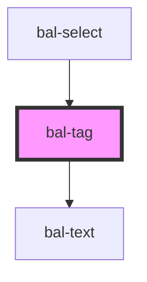

# bal-tag

<!-- Auto Generated Below -->

## Properties

| Property   | Attribute  | Description                                                  | Type                                                              | Default |
| ---------- | ---------- | ------------------------------------------------------------ | ----------------------------------------------------------------- | ------- |
| `closable` | `closable` | The theme type of the tag. Given by bulma our css framework. | `boolean`                                                         | `false` |
| `color`    | `color`    | The theme type of the tag. Given by bulma our css framework. | `"" \| "danger" \| "info" \| "primary" \| "success" \| "warning"` | `''`    |
| `size`     | `size`     | The size of the tag element                                  | `"" \| "large" \| "medium" \| "small"`                            | `''`    |

## Events

| Event           | Description                         | Type                      |
| --------------- | ----------------------------------- | ------------------------- |
| `balCloseClick` | Emitted when the input got clicked. | `CustomEvent<MouseEvent>` |

## Dependencies

### Used by

 - [bal-select](../bal-select)

### Depends on

- [bal-text](../bal-text)

### Graph

----------------------------------------------

*Built with [StencilJS](https://stenciljs.com/)*
