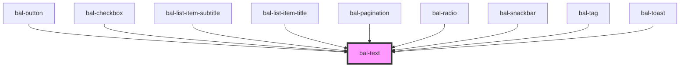

# Text

<!-- Auto Generated Below -->

## Properties

| Property | Attribute | Description                         | Type                                                                        | Default |
| -------- | --------- | ----------------------------------- | --------------------------------------------------------------------------- | ------- |
| `bold`   | `bold`    | If `true` the text is bold          | `boolean`                                                                   | `false` |
| `color`  | `color`   | Defines the color of the text.      | `"" \| "danger" \| "hint" \| "info" \| "primary" \| "success" \| "warning"` | `''`    |
| `small`  | `small`   | If `true` the text has a small size | `boolean`                                                                   | `false` |

## Dependencies

### Used by

 - [bal-button](../bal-button)
 - [bal-checkbox](../bal-checkbox)
 - [bal-list-item-subtitle](../bal-list-item-subtitle)
 - [bal-list-item-title](../bal-list-item-title)
 - [bal-pagination](../bal-pagination)
 - [bal-radio](../bal-radio)
 - [bal-snackbar](../bal-snackbar)
 - [bal-tag](../bal-tag)
 - [bal-toast](../bal-toast)

### Graph

----------------------------------------------

*Built with [StencilJS](https://stenciljs.com/)*
