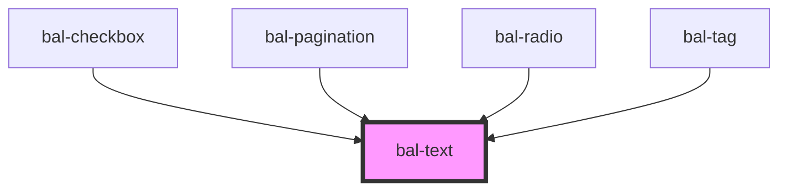

# Text

<!-- Auto Generated Below -->

## Properties

| Property | Attribute | Description                         | Type                                                              | Default |
| -------- | --------- | ----------------------------------- | ----------------------------------------------------------------- | ------- |
| `bold`   | `bold`    | If `true` the text is bold          | `boolean`                                                         | `false` |
| `color`  | `color`   | Defines the color of the text.      | `"" \| "danger" \| "hint" \| "primary" \| "success" \| "warning"` | `''`    |
| `small`  | `small`   | If `true` the text has a small size | `boolean`                                                         | `false` |

## Dependencies

### Used by

 - [bal-checkbox](../bal-checkbox)
 - [bal-pagination](../bal-pagination)
 - [bal-radio](../bal-radio)
 - [bal-tag](../bal-tag)

### Graph

----------------------------------------------

*Built with [StencilJS](https://stenciljs.com/)*
