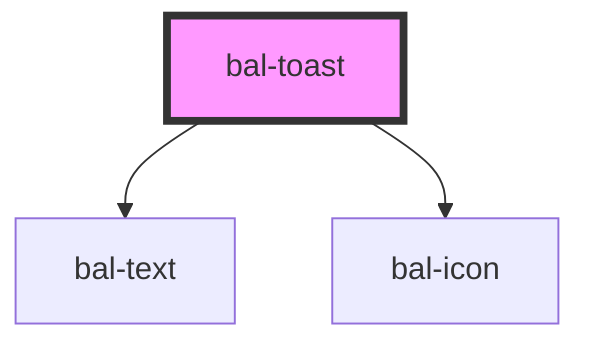

# Toast

<!-- Auto Generated Below -->

## Properties

| Property   | Attribute  | Description                                                    | Type                                                              | Default |
| ---------- | ---------- | -------------------------------------------------------------- | ----------------------------------------------------------------- | ------- |
| `color`    | `color`    | The theme type of the toast. Given by bulma our css framework. | `"" \| "danger" \| "info" \| "primary" \| "success" \| "warning"` | `''`    |
| `duration` | `duration` | The duration of the toast                                      | `number`                                                          | `0`     |

## Events

| Event      | Description                  | Type                  |
| ---------- | ---------------------------- | --------------------- |
| `balClose` | Emitted when toast is closed | `CustomEvent<string>` |

## Methods

### `close() => Promise<void>`

Closes this toast

#### Returns

Type: `Promise<void>`

### `closeIn(duration: number) => Promise<void>`

Closes the toast after the given duration in ms

#### Returns

Type: `Promise<void>`

## Dependencies

### Depends on

- [bal-text](../bal-text)
- [bal-icon](../bal-icon)

### Graph

----------------------------------------------

*Built with [StencilJS](https://stenciljs.com/)*
