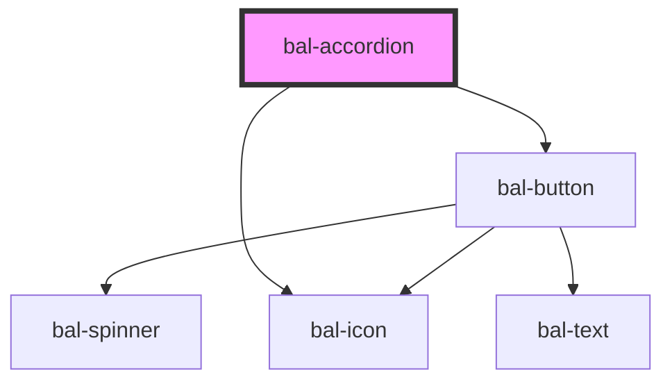

# bal-accordion

An accordion hides secondary content and requires user interaction to display the content.

<!-- Auto Generated Below -->

## Properties

| Property     | Attribute     | Description                                             | Type                  | Default     |
| ------------ | ------------- | ------------------------------------------------------- | --------------------- | ----------- |
| `card`       | `card`        | If `true` the accordion is used on the bottom of a card | `boolean`             | `false`     |
| `closeIcon`  | `close-icon`  | Bal-Icon of the close trigger button                    | `string`              | `'minus'`   |
| `closeLabel` | `close-label` | Label of the close trigger button                       | `string`              | `''`        |
| `color`      | `color`       | Type defines the theme of the accordion toggle          | `"info" \| "primary"` | `'primary'` |
| `isActive`   | `is-active`   | Controls if the accordion is collapsed or not           | `boolean`             | `false`     |
| `openIcon`   | `open-icon`   | Bal-Icon of the open trigger button                     | `string`              | `'plus'`    |
| `openLabel`  | `open-label`  | Label of the open trigger button                        | `string`              | `''`        |

## Events

| Event         | Description                            | Type                   |
| ------------- | -------------------------------------- | ---------------------- |
| `balCollapse` | Emmited when the accordion has changed | `CustomEvent<boolean>` |

## Methods

### `close() => Promise<void>`

Close the accordion

#### Returns

Type: `Promise<void>`

### `open() => Promise<void>`

Open the accordion

#### Returns

Type: `Promise<void>`

### `toggle() => Promise<void>`

Triggers the accordion

#### Returns

Type: `Promise<void>`

## Dependencies

### Depends on

- [bal-button](../bal-button)
- [bal-icon](../bal-icon)

### Graph

----------------------------------------------

*Built with [StencilJS](https://stenciljs.com/)*
