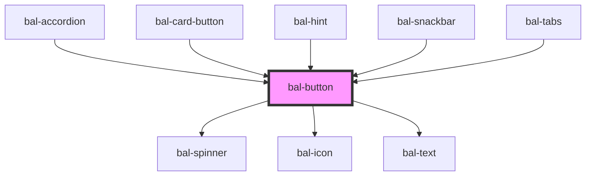

# bal-button

The classic button, in different colors, sizes, and states.

<!-- Auto Generated Below -->

## Properties

| Property        | Attribute        | Description                                                           | Type                                                                                    | Default        |
| --------------- | ---------------- | --------------------------------------------------------------------- | --------------------------------------------------------------------------------------- | -------------- |
| `bottomRounded` | `bottom-rounded` | If `true` the bottom corners get rounded                              | `boolean`                                                                               | `false`        |
| `dense`         | `dense`          | If `true` the button is dense                                         | `boolean`                                                                               | `undefined`    |
| `disabled`      | `disabled`       | If `true` the button is disabled                                      | `boolean`                                                                               | `undefined`    |
| `expanded`      | `expanded`       | If `true` the button has a full width                                 | `boolean`                                                                               | `undefined`    |
| `icon`          | `icon`           | Name of the left button icon                                          | `string`                                                                                | `''`           |
| `iconRight`     | `icon-right`     | Name of the right button icon                                         | `string`                                                                                | `''`           |
| `inverted`      | `inverted`       | If `true` the button is inverted                                      | `boolean`                                                                               | `undefined`    |
| `isActive`      | `is-active`      | If `true` the button has a active theme                               | `boolean`                                                                               | `false`        |
| `isSquare`      | `is-square`      | If `true` the width of the buttons is limited                         | `boolean`                                                                               | `undefined`    |
| `light`         | `light`          | If `true` the button has a light color                                | `boolean`                                                                               | `undefined`    |
| `loading`       | `loading`        | If `true` the label is hidden and a loading spinner is shown instead. | `boolean`                                                                               | `undefined`    |
| `outlined`      | `outlined`       | If `true` the button is outlined                                      | `boolean`                                                                               | `undefined`    |
| `size`          | `size`           | Size of the button                                                    | `"" \| "is-small"`                                                                      | `''`           |
| `type`          | `type`           | The theme type of the button. Given by bulma our css framework.       | `"is-danger" \| "is-info" \| "is-link" \| "is-primary" \| "is-success" \| "is-warning"` | `'is-primary'` |

## Dependencies

### Used by

 - [bal-accordion](../bal-accordion)
 - [bal-card-button](../bal-card-button)
 - [bal-hint](../bal-hint)
 - [bal-snackbar](../bal-snackbar)
 - [bal-tabs](../bal-tabs)

### Depends on

- [bal-spinner](../bal-spinner)
- [bal-icon](../bal-icon)
- [bal-text](../bal-text)

### Graph

----------------------------------------------

*Built with [StencilJS](https://stenciljs.com/)*
