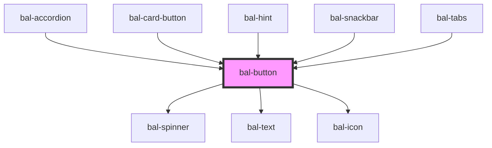

# bal-button

The classic button, in different colors, sizes, and states.

<!-- Auto Generated Below -->

## Properties

| Property        | Attribute        | Description                                                           | Type                                                                                                     | Default     |
| --------------- | ---------------- | --------------------------------------------------------------------- | -------------------------------------------------------------------------------------------------------- | ----------- |
| `bottomRounded` | `bottom-rounded` | If `true` the bottom corners get rounded                              | `boolean`                                                                                                | `false`     |
| `disabled`      | `disabled`       | If `true` the button is disabled                                      | `boolean`                                                                                                | `undefined` |
| `expanded`      | `expanded`       | If `true` the button has a full width                                 | `boolean`                                                                                                | `undefined` |
| `href`          | `href`           | Specifies the URL of the page the link goes to                        | `string`                                                                                                 | `''`        |
| `icon`          | `icon`           | Name of the left button icon                                          | `string`                                                                                                 | `''`        |
| `iconPosition`  | `icon-position`  | Size of the button                                                    | `"left" \| "right"`                                                                                      | `'left'`    |
| `iconRight`     | `icon-right`     | Name of the right button icon                                         | `string`                                                                                                 | `''`        |
| `inverted`      | `inverted`       | If `true` the button is inverted                                      | `boolean`                                                                                                | `undefined` |
| `isActive`      | `is-active`      | If `true` the button has a active theme                               | `boolean`                                                                                                | `false`     |
| `link`          | `link`           | Turn the button in to a link.                                         | `boolean`                                                                                                | `false`     |
| `loading`       | `loading`        | If `true` the label is hidden and a loading spinner is shown instead. | `boolean`                                                                                                | `undefined` |
| `outlined`      | `outlined`       | If `true` the button is outlined                                      | `boolean`                                                                                                | `undefined` |
| `size`          | `size`           | Size of the button                                                    | `"" \| "small"`                                                                                          | `''`        |
| `square`        | `square`         | If `true` the width of the buttons is limited                         | `boolean`                                                                                                | `undefined` |
| `target`        | `target`         | Specifies where to open the linked document                           | `" _parent" \| "_blank" \| "_self" \| "_top"`                                                            | `'_self'`   |
| `type`          | `type`           | The theme type of the button. Given by bulma our css framework.       | `"danger" \| "info" \| "info-light" \| "link" \| "primary" \| "primary-light" \| "success" \| "warning"` | `'primary'` |

## Dependencies

### Used by

 - [bal-accordion](../bal-accordion)
 - [bal-card-button](../bal-card-button)
 - [bal-hint](../bal-hint)
 - [bal-snackbar](../bal-snackbar)
 - [bal-tabs](../bal-tabs)

### Depends on

- [bal-spinner](../bal-spinner)
- [bal-text](../bal-text)
- [bal-icon](../bal-icon)

### Graph

----------------------------------------------

*Built with [StencilJS](https://stenciljs.com/)*
