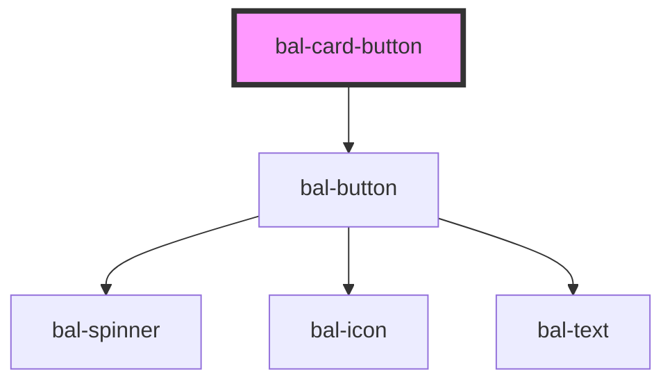

<!-- docs:child of bal-card -->

# bal-card-button

`bal-card-button` is a child component of `bal-card` that sets a block button at the end of the card. Good to use for edit functionality.

<!-- Auto Generated Below -->

## Properties

| Property | Attribute | Description                   | Type     | Default |
| -------- | --------- | ----------------------------- | -------- | ------- |
| `icon`   | `icon`    | Name of the icon like `edit`. | `string` | `''`    |

## Dependencies

### Depends on

- [bal-button](../bal-button)

### Graph

----------------------------------------------

*Built with [StencilJS](https://stenciljs.com/)*
