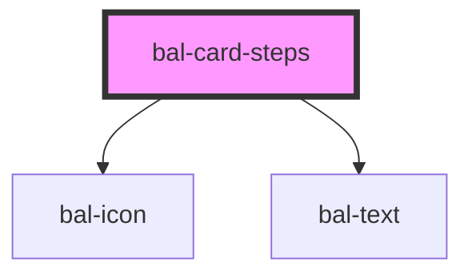

# bal-card-steps

The steps list is useful for tracking progress in multi steps forms or wizards.

<!-- Auto Generated Below -->

## Properties

| Property     | Attribute    | Description                                                  | Type      | Default |
| ------------ | ------------ | ------------------------------------------------------------ | --------- | ------- |
| `backLabel`  | `back-label` | Label for back button                                        | `string`  | `''`    |
| `hasBack`    | `has-back`   | If `true` the steps navigation has back button.              | `boolean` | `false` |
| `hidden`     | `hidden`     | If `true` the steps navigation is hidden.                    | `boolean` | `false` |
| `inverted`   | `inverted`   | If `true` a the style is ready for a dark background.        | `boolean` | `false` |
| `navigation` | `navigation` | If `true` the navigation is handled by the component         | `boolean` | `false` |
| `showLabel`  | `show-label` | Hides the navigation circles and adds the step label instead | `boolean` | `false` |

## Events

| Event               | Description                              | Type                             |
| ------------------- | ---------------------------------------- | -------------------------------- |
| `balBackClick`      | Emitted when the back button is clicked. | `CustomEvent<void>`              |
| `balCardStepChange` | Emitted when the changes has finished.   | `CustomEvent<BalCardStepOption>` |
| `balCardStepClick`  | Emitted when the step circle is clicked. | `CustomEvent<BalCardStepOption>` |

## Methods

### `select(step: BalCardStepOption) => Promise<void>`

Go to tab with the given value

#### Returns

Type: `Promise<void>`

### `sync() => Promise<void>`

#### Returns

Type: `Promise<void>`

## Dependencies

### Depends on

- [bal-icon](../bal-icon)
- [bal-text](../bal-text)

### Graph

----------------------------------------------

*Built with [StencilJS](https://stenciljs.com/)*
