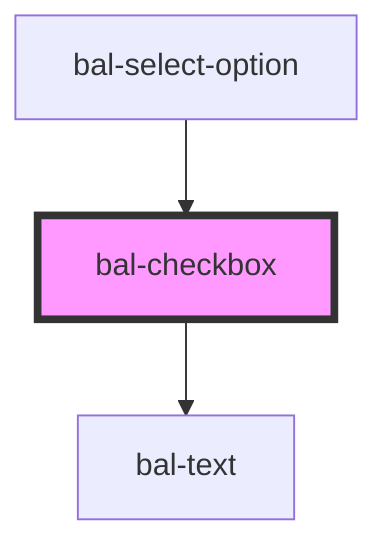

# bal-checkbox

Checkboxes allow the selection of multiple options from a set of options. They appear as checked (ticked) when activated. Clicking on a checkbox will toggle the **checked** property. They can also be checked programmatically by setting the **checked** property.

> Two-way binding with `v-model` or `ng-model` is available.

<!-- Auto Generated Below -->

## Properties

| Property      | Attribute      | Description                                                     | Type      | Default        |
| ------------- | -------------- | --------------------------------------------------------------- | --------- | -------------- |
| `balTabindex` | `bal-tabindex` | The tabindex of the control.                                    | `number`  | `0`            |
| `checked`     | `checked`      | If `true`, the checkbox is selected.                            | `boolean` | `false`        |
| `disabled`    | `disabled`     | If `true`, the user cannot interact with the checkbox.          | `boolean` | `false`        |
| `inverted`    | `inverted`     | If `true`, the control works on dark background.                | `boolean` | `false`        |
| `label`       | `label`        | The label of the control.                                       | `string`  | `''`           |
| `name`        | `name`         | The name of the control, which is submitted with the form data. | `string`  | `this.inputId` |
| `value`       | `value`        | The value of the control.                                       | `string`  | `'on'`         |

## Events

| Event       | Description                                    | Type                   |
| ----------- | ---------------------------------------------- | ---------------------- |
| `balBlur`   | Emitted when the toggle loses focus.           | `CustomEvent<void>`    |
| `balChange` | Emitted when the checked property has changed. | `CustomEvent<boolean>` |
| `balFocus`  | Emitted when the toggle has focus.             | `CustomEvent<void>`    |

## Methods

### `setFocus() => Promise<void>`

Sets the focus on the checkbox input element.

#### Returns

Type: `Promise<void>`

## Dependencies

### Used by

 - [bal-select-option](../bal-select-option)

### Depends on

- [bal-text](../bal-text)

### Graph

----------------------------------------------

*Built with [StencilJS](https://stenciljs.com/)*
