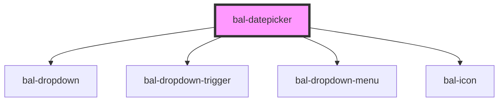

# bal-datepicker

An input with a simple dropdown for selecting a date.

<!-- Auto Generated Below -->

## Properties

| Property        | Attribute         | Description                                                                                | Type                           | Default     |
| --------------- | ----------------- | ------------------------------------------------------------------------------------------ | ------------------------------ | ----------- |
| `balTabindex`   | `bal-tabindex`    | The tabindex of the control.                                                               | `number`                       | `0`         |
| `closeOnSelect` | `close-on-select` | Closes the datepicker dropdown after selection                                             | `boolean`                      | `true`      |
| `disabled`      | `disabled`        | If `true` the component is diabled.                                                        | `boolean`                      | `false`     |
| `expanded`      | `expanded`        | If `true` the component uses the whole width.                                              | `boolean`                      | `false`     |
| `filter`        | --                | Callback to determine which date in the datepicker should be selectable.                   | `(date: Date) => boolean`      | `_ => true` |
| `inverted`      | `inverted`        | Set this to `true` when the component is placed on a dark background.                      | `boolean`                      | `false`     |
| `locale`        | `locale`          | If `true` the component uses the whole width.                                              | `"de" \| "en" \| "fr" \| "it"` | `'en'`      |
| `maxDate`       | --                | Latest date available for selection                                                        | `Date`                         | `undefined` |
| `maxYearProp`   | `max-year`        | Latest year available for selection                                                        | `number`                       | `undefined` |
| `minDate`       | --                | Earliest date available for selection                                                      | `Date`                         | `undefined` |
| `minYearProp`   | `min-year`        | Earliest year available for selection                                                      | `number`                       | `undefined` |
| `placeholder`   | `placeholder`     | Defines the placeholder of the input element.                                              | `string`                       | `''`        |
| `readonly`      | `readonly`        | If `true` the use can only select a date.                                                  | `boolean`                      | `false`     |
| `required`      | `required`        | If `true` the attribute required is added to the native input.                             | `boolean`                      | `false`     |
| `triggerIcon`   | `trigger-icon`    | If `true` the datepicker only open on click of the icon                                    | `boolean`                      | `false`     |
| `value`         | --                | Selected date. Could also be passed as a string, which gets transformed to js date object. | `Date`                         | `undefined` |

## Events

| Event       | Description                             | Type                      |
| ----------- | --------------------------------------- | ------------------------- |
| `balBlur`   | Emitted when the input loses focus.     | `CustomEvent<FocusEvent>` |
| `balChange` | Emitted when a option got selected.     | `CustomEvent<any>`        |
| `balFocus`  | Emitted when the input has focus.       | `CustomEvent<FocusEvent>` |
| `balInput`  | Emitted when a keyboard input occurred. | `CustomEvent<string>`     |

## Methods

### `select(date: Date) => Promise<void>`

Selects an option

#### Returns

Type: `Promise<void>`

## Dependencies

### Depends on

- [bal-dropdown](../bal-dropdown)
- [bal-dropdown-trigger](../bal-dropdown-trigger)
- [bal-dropdown-menu](../bal-dropdown-menu)
- [bal-icon](../bal-icon)

### Graph

----------------------------------------------

*Built with [StencilJS](https://stenciljs.com/)*
