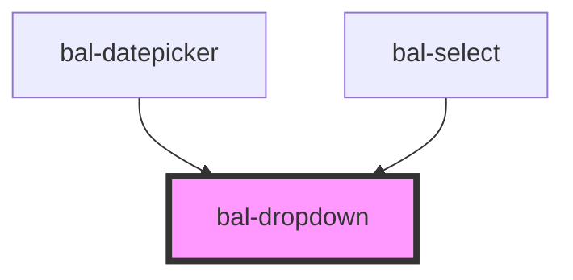

# bal-dropdown

<!-- Auto Generated Below -->

## Properties

| Property            | Attribute             | Description                                      | Type      | Default |
| ------------------- | --------------------- | ------------------------------------------------ | --------- | ------- |
| `expanded`          | `expanded`            | If `true` the field spans over the whole width.  | `boolean` | `false` |
| `fixedContentWidth` | `fixed-content-width` | If `true` the dropdown content has a fixed width | `boolean` | `false` |
| `isActive`          | `is-active`           | If `true` the dropdown content is open.          | `boolean` | `false` |
| `scrollable`        | `scrollable`          |                                                  | `number`  | `0`     |

## Events

| Event                | Description                                                                     | Type                   |
| -------------------- | ------------------------------------------------------------------------------- | ---------------------- |
| `balCollapse`        | Listen when the dropdown opens or closes. Returns the current `isActive` value. | `CustomEvent<boolean>` |
| `balDropdownPrepare` | *Internal* - Use this to close unuesed dropdowns.                               | `CustomEvent<string>`  |

## Methods

### `close() => Promise<void>`

Closes the dropdown menu.

#### Returns

Type: `Promise<void>`

### `getContentElement() => Promise<HTMLElement>`

Returns the `HTMLDivElement` of the content element

#### Returns

Type: `Promise<HTMLElement>`

### `open() => Promise<void>`

Open the dropdown menu.

#### Returns

Type: `Promise<void>`

### `toggle() => Promise<void>`

Open or closes the dropdown.

#### Returns

Type: `Promise<void>`

## Dependencies

### Used by

 - [bal-datepicker](../bal-datepicker)
 - [bal-select](../bal-select)

### Graph

----------------------------------------------

*Built with [StencilJS](https://stenciljs.com/)*
