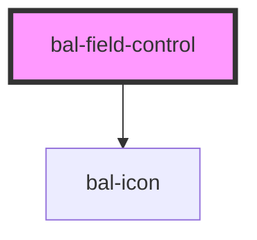

<!-- docs:child of bal-field -->

# bal-field-control

`bal-field-control` is a child component of `bal-field`.

<!-- Auto Generated Below -->

## Properties

| Property    | Attribute    | Description                                  | Type     | Default |
| ----------- | ------------ | -------------------------------------------- | -------- | ------- |
| `iconLeft`  | `icon-left`  | Baloise icon for the left side of the input  | `string` | `''`    |
| `iconRight` | `icon-right` | Baloise icon for the right side of the input | `string` | `''`    |

## Dependencies

### Depends on

- [bal-icon](../bal-icon)

### Graph

----------------------------------------------

*Built with [StencilJS](https://stenciljs.com/)*
