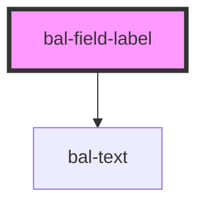

<!-- docs:child of bal-field -->

# bal-field-label

`bal-field-label` is a child component of `bal-field`.

<!-- Auto Generated Below -->

## Properties

| Property   | Attribute  | Description                                        | Type      | Default |
| ---------- | ---------- | -------------------------------------------------- | --------- | ------- |
| `required` | `required` | If `true` a asterix (*) is added to the label text | `boolean` | `false` |
| `text`     | `text`     | Text of the inputs label                           | `string`  | `''`    |

## Dependencies

### Depends on

- [bal-text](../bal-text)

### Graph

----------------------------------------------

*Built with [StencilJS](https://stenciljs.com/)*
