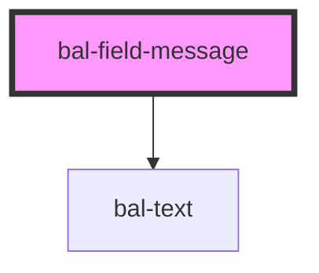

<!-- docs:child of bal-field -->

# bal-field-message

`bal-field-message` is a child component of `bal-field`.

<!-- Auto Generated Below -->

## Properties

| Property | Attribute | Description                       | Type                                       | Default |
| -------- | --------- | --------------------------------- | ------------------------------------------ | ------- |
| `type`   | `type`    | Defines the color of the message. | `"" \| "danger" \| "success" \| "warning"` | `''`    |

## Dependencies

### Depends on

- [bal-text](../bal-text)

### Graph

----------------------------------------------

*Built with [StencilJS](https://stenciljs.com/)*
