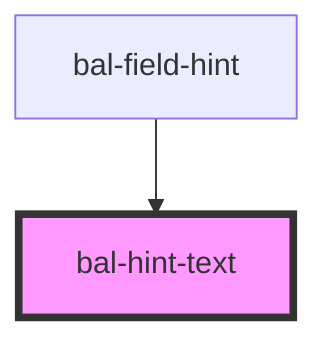

<!-- docs:child of bal-hint -->

# bal-hint-text

`bal-hint-text` is a child component of `bal-hint` that defines the text of the hint dialog.

<!-- Auto Generated Below -->

## Dependencies

### Used by

 - [bal-field-hint](../bal-field-hint)

### Graph

----------------------------------------------

*Built with [StencilJS](https://stenciljs.com/)*
