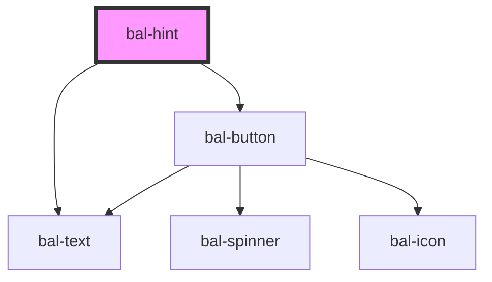

# bal-hint

Display a helper text. Use this to explain complicted form fields.

<!-- Auto Generated Below -->

## Properties

| Property     | Attribute     | Description                                         | Type      | Default   |
| ------------ | ------------- | --------------------------------------------------- | --------- | --------- |
| `closeLabel` | `close-label` | Text for the close button.                          | `string`  | `'Close'` |
| `disabled`   | `disabled`    | If `true`, the user cannot interact with the input. | `boolean` | `false`   |

## Methods

### `close() => Promise<void>`

Closes the hint box.

#### Returns

Type: `Promise<void>`

### `open() => Promise<void>`

Opens the hint box.

#### Returns

Type: `Promise<void>`

### `toggle() => Promise<void>`

Toggles the hint box.

#### Returns

Type: `Promise<void>`

## Dependencies

### Depends on

- [bal-text](../bal-text)
- [bal-button](../bal-button)

### Graph

----------------------------------------------

*Built with [StencilJS](https://stenciljs.com/)*
