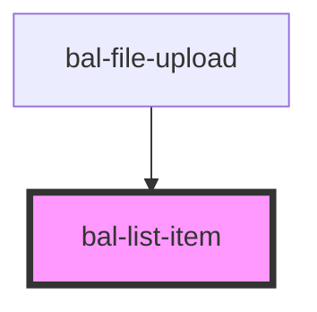

<!-- docs:child of bal-list -->

# bal-list-item

<!-- Auto Generated Below -->

## Properties

| Property   | Attribute  | Description                                  | Type      | Default |
| ---------- | ---------- | -------------------------------------------- | --------- | ------- |
| `disabled` | `disabled` | If `true` the list item can be hovered       | `boolean` | `false` |
| `selected` | `selected` | If `true` the list item has a selected theme | `boolean` | `false` |

## Dependencies

### Used by

 - [bal-file-upload](../bal-file-upload)

### Graph

----------------------------------------------

*Built with [StencilJS](https://stenciljs.com/)*
