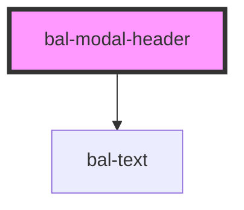

<!-- docs:child of bal-modal -->

# bal-modal-header

`bal-modal-header` is a child component of `bal-modal` that has the title of the modal.

<!-- Auto Generated Below -->

## Dependencies

### Depends on

- [bal-text](../bal-text)

### Graph

----------------------------------------------

*Built with [StencilJS](https://stenciljs.com/)*
