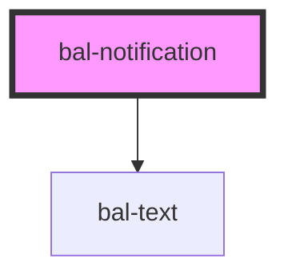

# bal-notification

A notification is used for alerts or to highlight certain content for the user.

<!-- Auto Generated Below -->

## Properties

| Property | Attribute | Description                      | Type                                                              | Default |
| -------- | --------- | -------------------------------- | ----------------------------------------------------------------- | ------- |
| `color`  | `color`   | Defines the color of the element | `"" \| "danger" \| "info" \| "primary" \| "success" \| "warning"` | `''`    |

## Dependencies

### Depends on

- [bal-text](../bal-text)

### Graph

----------------------------------------------

*Built with [StencilJS](https://stenciljs.com/)*
