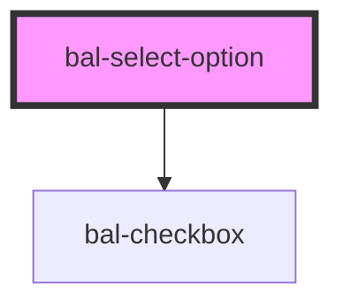

<!-- docs:child of bal-select -->

# bal-select-option

<!-- Auto Generated Below -->

## Properties

| Property   | Attribute  | Description                                                                                       | Type                  | Default     |
| ---------- | ---------- | ------------------------------------------------------------------------------------------------- | --------------------- | ----------- |
| `checkbox` | `checkbox` | If `true` the option has a checkbox                                                               | `boolean`             | `false`     |
| `focused`  | `focused`  | If `true` the option is focused                                                                   | `boolean`             | `false`     |
| `hidden`   | `hidden`   | If `true` the option is hidden                                                                    | `boolean`             | `false`     |
| `label`    | `label`    | Label will be shown in the input element when it got selected                                     | `string \| undefined` | `undefined` |
| `selected` | `selected` | If `true` the option is selected                                                                  | `boolean`             | `false`     |
| `value`    | `value`    | The value of the select option. This value will be returned by the parent `<bal-select>` element. | `string \| undefined` | `undefined` |

## Dependencies

### Depends on

- [bal-checkbox](../bal-checkbox)

### Graph

----------------------------------------------

*Built with [StencilJS](https://stenciljs.com/)*
