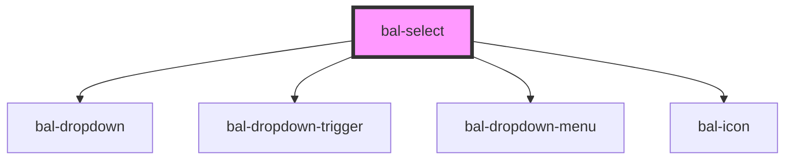

# bal-select

Select fields components are used for collecting user provided information from a list of options.

## Option interface

```typescript
export interface BalOptionValue<T> {
  value: string
  label: string
  data?: T
}
```

<!-- Auto Generated Below -->


## Properties

| Property            | Attribute            | Description                                                                       | Type       | Default |
| ------------------- | -------------------- | --------------------------------------------------------------------------------- | ---------- | ------- |
| `balTabindex`       | `bal-tabindex`       | The tabindex of the control.                                                      | `number`   | `0`     |
| `disabled`          | `disabled`           | If `true` the component is diabled.                                               | `boolean`  | `false` |
| `expanded`          | `expanded`           | If `true` the component uses the whole width.                                     | `boolean`  | `false` |
| `filterPlaceholder` | `filter-placeholder` | Defines the placeholder of the input filter element.                              | `string`   | `''`    |
| `inverted`          | `inverted`           | Set this to `true` when the component is placed on a dark background.             | `boolean`  | `false` |
| `loading`           | `loading`            | If `true` the component shows a loading spinner and sets the input to readonly.   | `boolean`  | `false` |
| `multiple`          | `multiple`           | If `true` multiple option can be selected                                         | `boolean`  | `false` |
| `noFilter`          | `no-filter`          | If `true` the filtering of the options is done outside of the component.          | `boolean`  | `false` |
| `placeholder`       | `placeholder`        | Defines the placeholder of the input element.                                     | `string`   | `''`    |
| `required`          | `required`           | If `true` the attribute required is added to the native input.                    | `boolean`  | `false` |
| `scrollable`        | `scrollable`         | Defines the height of the dropdown list.                                          | `number`   | `250`   |
| `typeahead`         | `typeahead`          | If `true` the user can search by typing into the input field.                     | `boolean`  | `false` |
| `value`             | --                   | Selected option values. Could also be passed as a string, which gets transformed. | `string[]` | `[]`    |


## Events

| Event         | Description                                                        | Type                         |
| ------------- | ------------------------------------------------------------------ | ---------------------------- |
| `balBlur`     | Emitted when the input loses focus.                                | `CustomEvent<FocusEvent>`    |
| `balCancel`   | Emitted when the user cancels the input.                           | `CustomEvent<KeyboardEvent>` |
| `balChange`   | Emitted when a option got selected.                                | `CustomEvent<string[]>`      |
| `balClick`    | Emitted when the input got clicked.                                | `CustomEvent<MouseEvent>`    |
| `balFocus`    | Emitted when the input has focus.                                  | `CustomEvent<FocusEvent>`    |
| `balInput`    | Emitted when a keyboard input occurred.                            | `CustomEvent<string>`        |
| `balKeyPress` | Emitted when the input has focus and key from the keyboard go hit. | `CustomEvent<KeyboardEvent>` |


## Methods

### `clear() => Promise<void>`

Sets the value to null and resets the value of the input.

#### Returns

Type: `Promise<void>`


### `close() => Promise<void>`

Closes the dropdown

#### Returns

Type: `Promise<void>`


### `open() => Promise<void>`

Opens the dropdown

#### Returns

Type: `Promise<void>`


### `select(option: BalOptionValue<any>) => Promise<void>`

Selects an option

#### Returns

Type: `Promise<void>`


### `setFocus() => Promise<void>`

Sets the focus on the input element

#### Returns

Type: `Promise<void>`


### `sync() => Promise<void>`

*Internal* - Used to update option changes

#### Returns

Type: `Promise<void>`


## Dependencies

### Depends on

- [bal-dropdown](../bal-dropdown)
- [bal-dropdown-trigger](../bal-dropdown-trigger)
- [bal-dropdown-menu](../bal-dropdown-menu)
- [bal-icon](../bal-icon)

### Graph


----------------------------------------------

*Built with [StencilJS](https://stenciljs.com/)*
